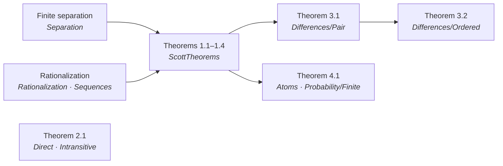
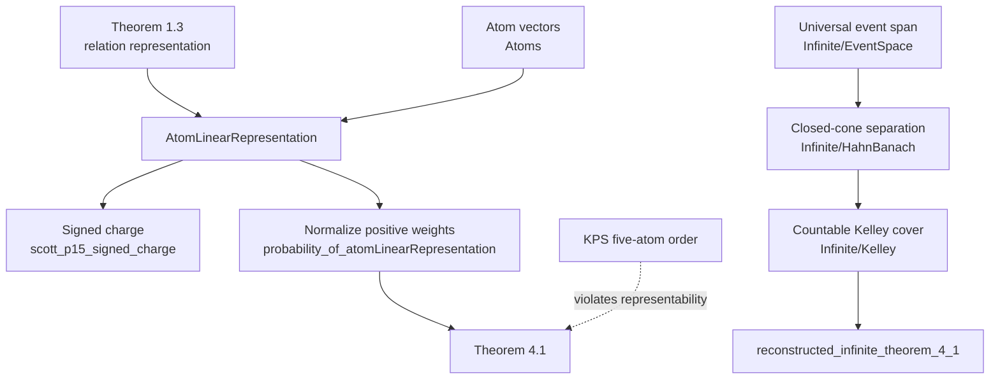

# Formalization of Scott's Measurement Structures and Linear Inequalities in Lean 4

**Authors.** Lars Warren Ericson (independent researcher, d/b/a Catskills
Research Company; lars.ericson@catskillsresearch.com), Dana S. Scott (Computer Science
Department, Carnegie Mellon University, Emeritus), Vijay D'Silva (Google
Research), and Brian Milnes (Unaffiliated).
**Technical report.** CMU-CS-26-XXX, School of Computer Science, Carnegie
Mellon University, Pittsburgh, PA 15213.
**Source paper.** Dana S. Scott, *Measurement Structures and Linear
Inequalities*, Journal of Mathematical Psychology 1 (1964), 233–247.
**Repository.** https://github.com/catskillsresearch/scott1964
**Cross-archive.** This report will also be deposited on arXiv in cs.LO and
math.LO.

---

## Abstract

Scott's 1964 paper *Measurement Structures and Linear Inequalities* gives a
unified finite separation criterion for qualitative systems represented by
homogeneous linear inequalities, with applications to intransitive
indifference, ordered utility differences, and subjective probability. This
report presents a Lean 4 / Mathlib formalization of all eight numbered
theorems (1.1--1.4, 2.1, 3.1, 3.2, and 4.1), together with Scott's
ordered-group and signed-charge remarks. The development comprises roughly
4,200 lines across 21 modules. It makes cancellation hypotheses explicit,
formalizes the rational-to-integer reduction underlying finite sequence
conditions, and verifies the incidence-vector constructions used by the three
applications. Supplementary results include the
Kraft--Pratt--Seidenberg counterexample to de Finetti's axioms and a clearly
labelled, stronger modern infinite `iff` characterization—first presented
here and adapting Kelley's 1959 method—under a generalized Kelley condition.
The Lean library is sorry-free and introduces no project axioms beyond
Mathlib's classical footprint. Large-language-model assistance was used in
drafting and proof development, but every accepted declaration is checked by
Lean's kernel under the pinned toolchain. The complete source and reproducible
build pipeline are publicly available with this report.

## 1. Introduction and Historical Context

### 1.1 Historical context

Measurement theory studies how observed or judged structure can be expressed
numerically. Here “measurement” need not involve a physical instrument.
The starting data may instead be statements such as “$x$ is definitely
preferred to $y$,” “the change from $y$ to $x$ is at least as large as the
change from $w$ to $z$,” or “event $E$ is at least as likely as event $F$.”
A numerical representation assigns real numbers while preserving exactly
those comparisons. This question is broad: it connects the foundations of
measurement with utility theory, mathematical psychology, decision theory,
and probability.

The three applications in Scott's paper illustrate different forms that such
a representation can take. For alternatives, imagine that two objects count
as discernibly different only when their scores differ by at least one unit:
$xPy$ is represented by $f(x)\geq f(y)+1$. Nearby scores can then model
indifference even when that indifference is not transitive. For pairs, imagine
bundles containing one item of each of two kinds; comparing
$(x,x')$ with $(y,y')$ by
$f(x)+f'(x')\geq f(y)+f'(y')$ says that the two components contribute
additively. For events, a judgment such as “rain is at least as likely as a
train delay” is represented by $\mu(E)\geq\mu(F)$, where $\mu$ is a finitely
additive probability. In each case qualitative data are being translated into
arithmetic, but the arithmetic has a different interpretation.

Representation theorems have two directions. **Necessity** asks which
qualitative laws must hold whenever a numerical representation already
exists; this direction is usually checked by calculating with the proposed
numbers. **Sufficiency** starts only from those qualitative laws and proves
that some suitable numerical assignment must exist. Sufficiency is the harder
and more consequential direction: without it, a list of axioms describes
properties of a model one hopes to have, but does not show that the model can
be constructed. A necessary-and-sufficient theorem therefore identifies
exactly when qualitative observations admit the intended numerical reading.

Scott's article belongs to a developing program in representational
measurement. Luce's work on semiorders supplied the initial setting for
intransitive indifference **[Luc56]**, and Scott and Suppes had already given
a complete finite representation theorem for that problem **[SS58]**.
Kraft, Pratt, and Seidenberg had treated finite qualitative probability
**[KPS59]**, while work on additive and conjoint measurement provided the
setting for comparisons of pairs and differences **[LT64]**. Published in the
first volume of the *Journal of Mathematical Psychology* in 1964
**[Sco64]**, Scott's paper did more than collect these questions: it showed
that a common finite linear-inequality method could generate their
representation conditions. Cancellation axioms, additive representations,
and separation arguments subsequently became standard themes in systematic
treatments of measurement theory **[KLS71]**.

That unification makes the article a particularly informative formalization
target. It has a reusable mathematical core, three applications with familiar
interpretations, and proofs that move between qualitative relations,
finite-dimensional geometry, and explicit numerical models. A proof assistant
must make every move in that passage precise, while a useful report must also
recover the human meaning of the resulting definitions and proof terms. This
formalization was undertaken after Dana S. Scott suggested the paper as a
target for mechanization.

### 1.2 Retrospective Remarks by Dana S. Scott

For some time a group of colleagues of mine have been helping get PDFs of my old papers in shape to archive in the CMU Library. Two of them, Brian Milnes and Lars Ericson, are long ago CMU students from the 1980s.  As a result of hearing a recent Milnes' Zoom talk from CMU, I arranged for him to give his talk in Berkeley at the Topos Institute.  Subsequently he and I started a collaboration so I could learn to use an AI Agent, and that is how we discovered recent work of Ericson when the agent did a literature search.

As an example of some easy-to-understand mathematics, I asked Ericson to use AI Agents to formalize in Lean 4 this old paper of mine from 1964. This report is on how the formalization was done and verified, and — more importantly — on how a human can read it and understand the results and the whole process. We hope this can then be a good model for presenting other formalization work.

## 2. Mathematical Background

### 2.1 Finite linear inequalities and cancellation

The common question behind the examples is this: when does a finite
qualitative relation agree *exactly* with inequalities produced by one
real-valued function? “Exactly” requires both directions. Every declared
comparison must become a valid inequality, and every valid inequality among
the encoded objects must correspond to a declared comparison. Solving the
question directly and separately for each kind of relation would hide their
shared structure.

Scott's answer is to encode each qualitative comparison as a vector and ask
for one linear functional that gives every vector the prescribed sign. A
utility comparison between $a$ and $b$, for example, can be encoded by the
difference of their coordinate vectors; applying a functional produces
$f(a)-f(b)$. A comparison of two-component bundles is encoded by adding the
coordinates of their components, and an event is encoded by its $0/1$
incidence vector on the underlying atoms. After these translations, preference,
additive utility, and comparative probability all become finite systems of
homogeneous linear inequalities.

The obstruction also has a qualitative interpretation. If positively judged
comparisons can be added with positive weights to obtain the zero vector, then
any representing functional must assign zero to the whole sum. It cannot make
one summand strictly positive while keeping all the others nonnegative.
**Cancellation** rules out precisely such contradictory ledgers of
comparisons. A finite separation theorem then turns the absence of a
contradictory ledger into a functional that separates strict comparisons from
neutral ones. Thus necessity is obtained by applying a functional to a
vanishing sum, while sufficiency is supplied by geometric separation.

Formally, for a finite symmetric set $X$ in a real vector space and a chosen
"nonnegative" part $N\subseteq X$, a realization is a linear functional
$\varphi$ satisfying

$$
x\in N \quad\Longleftrightarrow\quad 0\leq\varphi(x)
\qquad (x\in X).
$$

Sign completeness ensures that every $x\in X$ receives at least one weak
sign. Cancellation prevents a positive combination of strictly positive
vectors from collapsing into the neutral span. Together these conditions
separate the strict cone from the neutral subspace and produce
$\varphi$. Rational coordinates permit positive real coefficients to be
replaced by integer multiplicities, yielding Scott's unweighted sequence
conditions. The core predicates are as follows:

```lean
def Realizable (X N : Set L) : Prop :=
  ∃ φ : Module.Dual ℝ L, ∀ x ∈ X, x ∈ N ↔ 0 ≤ φ x

def SignComplete (X N : Set L) : Prop :=
  ∀ ⦃x⦄, x ∈ X → x ∈ N ∨ -x ∈ N

def WeightedSequenceCancellation (X N : Set L) : Prop :=
  ∀ (n : ℕ) (x : Fin (n + 1) → L) (c : Fin (n + 1) → ℝ),
    (∀ i, x i ∈ X) → (∀ i, x i ∈ N) → (∀ i, 0 < c i) →
    ∑ i, c i • x i = 0 → ∀ i, -x i ∈ N
```

### 2.2 Solvable measurement structures

The three applications use different incidence vectors but the same engine.
The informal questions and their numerical answers are:

1. **Intransitive indifference.** A strict relation $P$ on a finite set is
   interpreted as “noticeably preferred.” It is represented by
   $xPy\iff f(x)\geq f(y)+1$. Two alternatives less than one unit apart are
   indifferent; because “within one unit” need not be transitive, the model
   captures limited discrimination rather than forcing indifference classes.
2. **Ordered differences.** Comparisons of pairs are represented first by
   an additive score $f(x)+f'(x')$. When a four-place relation instead asks
   whether the change from $y$ to $x$ is at least the change from $w$ to $z$,
   reversal combines the two scales into the single utility difference
   $f(x)-f(y)$.
3. **Subjective probability.** An event in a finite Boolean algebra is sent
   to its $0/1$ incidence vector on atoms. Qualitative comparisons of events
   become comparisons of sums of atom weights. A separating functional gives
   those weights, which normalize to a finitely additive probability.

The formalization follows this mathematical decomposition rather than
treating the eight theorems as unrelated endpoints. It also records where a
proof route differs from Scott's exposition: most importantly, Theorem 2.1
currently uses a direct finite Scott–Suppes staircase construction, while
Scott's local cycle reductions are formalized separately.

### 2.3 A proof-development lifecycle

This case study also illustrates why a mathematically inclined reader might
formalize an existing proof. Formalized mathematics can be viewed as an
emerging **proof-development lifecycle**, analogous—but not identical—to the
software development lifecycle. A theorem must be stated against precise
interfaces, decomposed into reusable components, checked continuously as those
components change, and delivered with enough documentation and provenance for
another person to audit it. Proof development differs from ordinary
programming in two important respects: discovering a proof can be the central
difficulty, and a successful kernel check gives unusually strong assurance
about the formal statement while still leaving humans responsible for whether
that statement faithfully expresses the intended mathematics.

Several layers make such a lifecycle practical here:

1. Lean provides the basic language of types, propositions, functions,
   quantifiers, and equality.
2. The elaborator and common proof tools provide routine reasoning support,
   including rewriting, simplification, and certified arithmetic automation.
3. Mathlib provides domain-independent mathematical infrastructure: finite
   sums and permutations, finite-dimensional linear algebra, convexity and
   separation, quotient orders, and finite Boolean algebras.
4. This repository supplies the measurement-specific layer absent from the
   general library: cancellation predicates, incidence-vector encodings,
   Scott–Suppes preference constructions, and the interfaces for utility and
   probability representations.

The boundaries between these layers are mathematically informative. A
reference used in the 1964 proof need not already exist in a library under the
same name or formulation. The formalizer can identify the property actually
needed, derive it from available results, and isolate the new
domain-specific argument. In this development, for example, Mathlib's
compact-closed separation theorem replaces Scott's cited finite-polyhedral
separation result, while the measurement-theoretic reductions are proved
locally.

AI-assisted drafting can reduce the cost of searching libraries, proposing
encodings, and translating informal proof steps, but it does not remove the
need for source comparison, theorem design, or kernel verification. Moreover,
**autoformalization**—moving from prose to formal statements and proofs—is
only half of the communication problem. The reverse movement, sometimes
called **deformalization**, explains machine-checked objects in ordinary
mathematical language and relates them back to the source question. This
report makes that return path explicit: its architecture and theorem
inventory expose the formal interfaces, its proof narratives explain the
mathematics, and the source–Lean concordance places Scott's text, exact Lean
declarations, and human-readable reconstructions side by side. That
combination of formal certificate and readable reconstruction is the model
for presenting formalization work tested by this article.

## 3. Lean 4 Architecture and Design Decisions

### 3.1 Scope and module layout

The library has 21 Lean modules and approximately 4,200 lines. The root
re-export module is
`Scott1964/MeasurementStructures/Basic.lean`, which `Solution.lean` imports.

| Module cluster | Role |
| --- | --- |
| `FinHead` | Stable distinguished index in `Fin (n + 1)` cancellation schemes |
| `LinearInequalities/Definitions`, `Separation`, `Sequences` | Geometric and sequence forms of Scott's finite inequality criterion |
| `LinearInequalities/Rationalization`, `ScottTheorems` | Rational coefficient clearing and Theorems 1.1–1.4 |
| `LinearInequalities/OrderedGroup` | Finite local real embedding and lexicographic obstruction |
| `Preference/Direct`, `Intransitive`, `Cycle` | Scott–Suppes construction, Theorem 2.1, and source proof reductions |
| `Differences/Pair`, `Ordered` | Incidence vectors and Theorems 3.1–3.2 |
| `Probability/Basic`, `Atoms`, `Finite` | Finitely additive probabilities, atom vectors, signed charges, and Theorem 4.1 |
| `Probability/KPSCounterexample` | Exact five-atom KPS qualitative order and nonrepresentability |
| `Probability/Infinite/*` | Universal event space, Hahn–Banach/Kelley machinery, and the modern infinite reconstruction |
| `Challenge` / `Solution` | Optional stub module and sorry-free re-export of the library |

The published scope is exactly the eight numbered theorems. Supplementary
results are clearly separated from that inventory:

- `finite_local_real_embedding` formalizes Scott's ordered-group observation;
- `scott_p15_signed_charge` and its vector form formalize the p. 15
  signed-measure characterization;
- `deFinetti_axioms_insufficient` integrates the KPS five-atom obstruction;
- `reconstructed_infinite_theorem_4_1` is a new modern theorem first presented
  here, adapting Kelley's method and motivated by, but not identified with,
  Scott's closing announcement.

The project is standalone. It imports none of the sibling formalizations of
Scott's later domain-theory papers.

### 3.2 Mathlib integration

Mathlib supplies the finite-dimensional analytic and algebraic substrate.
The predicates and reductions specific to Scott's paper are defined in this
repository.

**Finite-dimensional separation.** The key imported result is
`geometric_hahn_banach_compact_closed` from mathlib's locally convex
separation library. The formalization specializes it to a finite convex hull
and a finite-dimensional subspace. It then proves that the separator
vanishes on the subspace and is strictly positive on the finite set:

```lean
theorem finite_strict_separation {A B : Set L} (hA : A.Finite) :
    Disjoint (convexHull ℝ A) (Submodule.span ℝ B : Set L) ↔
      ∃ φ : Module.Dual ℝ L,
        (∀ x ∈ A, 0 < φ x) ∧ ∀ x ∈ B, φ x = 0
```

**Finite combinatorics.** Cancellation schemes are indexed by
`Fin (n + 1)` so that a distinguished comparison always exists. `Equiv.Perm`
expresses Scott's two independent permutations in the pair and
difference problems. `Finset` sums, subtype cardinalities, and
`Equiv.ofFiberEquiv` turn equality of incidence-vector sums into actual
permutations.

**Linear algebra over function spaces.** Scott's vectors are represented as
functions into $\mathbb{R}$. Pair incidence vectors live in
$\mathrm{Sum}\,A\,A' \to \mathbb{R}$; event vectors live in
$\{a : B \mid \mathrm{IsAtom}\,a\} \to \mathbb{R}$. Mathlib linear maps provide the
representing functionals, while `Pi.single` and finite sums implement the
coordinate encodings.

**Finite Boolean algebras.** Mathlib's `BooleanAlgebra`, `IsAtom`, and
finite-lattice API support decomposition of each event as the supremum of
its atoms. The formalization proves both the atom-count and vector-sum
versions of cancellation and constructs finitely additive functions by
integrating atom weights.

**Classical quotient orders.** The direct proof of Theorem 2.1 uses
`Antisymmetrization` of a finite total preorder. Substitutability classes
remove duplicate preference profiles, and a recursively constructed
staircase gives the numerical representation.

**Functional analysis for the supplementary infinite theorem.** The
universal event space is a normed span of evaluation functions on all
finitely additive probabilities. Continuous dual separation and a
countable Kelley cover produce one functional that is nonnegative on weak
comparisons and positive on strict comparisons.

What mathlib does not supply is Scott's measurement-theoretic interface:
the sign and cancellation conditions, relation-difference encoding,
Scott–Suppes weak order, pair permutation principle, atom-vector transport,
or generalized Kelley condition. Those constructions are developed here.
This division of labor is also reflected in the exposition. Each major result
is presented first as a question about qualitative structure, then as a
mathematical reduction, and finally as a checked Lean declaration. The code
shows what the machine verifies; the surrounding proof narrative explains why
the definitions express Scott's question and why the reduction works. Section
4 closes the loop by aligning both views with the source text.

### 3.3 Proof dependency structure

The main published development follows one linear-inequality core and three
applications.

<!-- figure-caption: Main published dependency structure: finite separation core and the three applications. -->


Theorem 2.1 is shown as an independent branch because its completed proof is
the direct Scott–Suppes construction. The source-facing cycle lemmas remain
available for a future proof routed through the section-1 machinery.

The finite probability and modern infinite developments have distinct
foundations:

<!-- figure-caption: Finite subjective probability pipeline and the supplementary infinite reconstruction. -->


### 3.4 Verified theorem inventory

| Paper result | Lean theorem | Content |
| --- | --- | --- |
| Theorem 1.1 | `LinearInequalities.scott_theorem_1_1` | Finite symmetric sign systems: realizability iff sign completeness and positive-weight cancellation |
| Theorem 1.2 | `LinearInequalities.scott_theorem_1_2` | Rational-coordinate version with unweighted repeated summands |
| Theorem 1.3 | `LinearInequalities.scott_theorem_1_3` | Complete relations on finite rational vectors: realizability iff paired equal-sums cancellation |
| Theorem 1.4 | `LinearInequalities.scott_theorem_1_4` | Realizability iff extension to a strictly monotonic relation on the additive closure |
| Theorem 2.1 | `theorem_2_1` | Intransitive-indifference representation with unit discrimination threshold |
| Theorem 3.1 | `theorem_3_1` | Additive representation of pair comparisons by two utilities |
| Theorem 3.2 | `theorem_3_2` | Ordered-difference representation by one utility |
| Theorem 4.1 | `theorem_4_1` | Finite qualitative probability representation |

Further source-facing or diagnostic results:

| Topic | Lean theorem | Status |
| --- | --- | --- |
| Literal form of `(4_B)` | `theorem_4_1_vector` | Equivalent vector-sum version of Theorem 4.1 |
| Scott's p. 15 signed charge | `scott_p15_signed_charge` (+ vector form) | Proved without normalization or nonnegativity |
| Ordered-group remark | `finite_local_real_embedding` | Proved for each finite subset |
| Global obstruction | `no_global_real_additive_lex_realization` | Lexicographic $\mathbb{Z}\times\mathbb{Z}$ has no global additive real representation |
| KPS counterexample | `deFinetti_axioms_insufficient` | Exact five-atom order satisfies bundled de Finetti axioms but has no probability realization |
| Infinite analogue | `reconstructed_infinite_theorem_4_1` | New modern `iff` result adapting Kelley; not attributed to Scott |

### 3.5 Formal proof architecture

#### Theorem 1.1 — finite separation

Let $X$ be finite and symmetric, and let $N\subseteq X$ denote the
vectors declared nonnegative. The strict vectors are those $x\in N$ for
which $-x\notin N$; the neutral vectors have both signs. Scott's
cancellation hypothesis states geometrically that the convex hull of the
strict set is disjoint from the linear span of the neutral set.

`weightedCancellation_of_sequence` derives this geometric disjointness from
the literal positive-weight sequence condition. It expands a hypothetical
intersection point twice: as a convex combination of strict vectors and as a
linear combination of neutral vectors. Signs of the latter coefficients are
absorbed using symmetry, producing one positive finite dependence. Sequence
cancellation would force the negative of a strict vector into $N$, a
contradiction.

`finite_strict_separation` then produces a linear functional positive on
strict vectors and zero on neutral vectors. Sign completeness proves that
the functional realizes $N$:

```lean
theorem scott_theorem_1_1 {X N : Set L}
    (hX : X.Finite) (hsym : Symmetric X) :
    Realizable X N ↔
      SignComplete X N ∧ WeightedSequenceCancellation X N
```

The two sides are exact. `Realizable X N` asks for one linear functional that
is nonnegative precisely on the vectors declared to be in $N$.
`SignComplete` says that each vector in the symmetric test set has at least
one weak sign: $x\in N$ or $-x\in N$. `WeightedSequenceCancellation` says that
if vectors in $N$, each multiplied by a strictly positive real coefficient,
sum to zero, then every summand is neutral—its negative also belongs to $N$.
The necessary direction is elementary: apply a realizing functional to such a
positive dependence and compare signs.

#### Theorem 1.2 — rationalization

Theorem 1.2 replaces arbitrary positive real coefficients with repeated
unit coefficients when vectors have rational coordinates. The nontrivial direction of the rational weighted-to-unweighted reduction
(`UnweightedSequenceCancellation.rationalWeighted`) is factored through
`Rationalization.lean`:

The pipeline is: replace a positive real dependence by a positive rational
dependence; clear denominators to positive natural multiplicities; repeat
each vector according to its multiplicity; apply unweighted cancellation to
the resulting finite sequence. This is the precise point where `[Fintype S]`
and `IsRationalSet X` enter. Theorem 1.1 then supplies the realizing
functional:

```lean
theorem scott_theorem_1_2 {S : Type*} [Fintype S] {X N : Set (S → ℝ)}
    (hX : X.Finite) (hrat : IsRationalSet X) (hsym : Symmetric X) :
    Realizable X N ↔ SignComplete X N ∧ UnweightedSequenceCancellation X N
```

Here `UnweightedSequenceCancellation` has the same conclusion as the weighted
condition, but its hypothesis is simply that a nonempty finite sequence of
vectors in $N$ sums to zero. Repetition supplies integer multiplicity. The
rational-coordinate and finite-dimensional hypotheses are what permit the
positive real coefficients of Theorem 1.1 to be replaced by rational
coefficients, cleared denominators, and finally repetitions.

#### Theorems 1.3 and 1.4 — relations and additive closure

For a relation $R$ on a finite set $Y$, Theorem 1.3 moves from points to
differences $x-y$. Completeness gives sign completeness of the difference
set. Scott's paired equal-sums condition gives unweighted cancellation:

$$
\sum_i x_i=\sum_i y_i,\quad x_i R y_i\ \text{for every }i
\quad\Longrightarrow\quad y_i R x_i\ \text{for every }i.
$$

The proof constructs the symmetric rational difference set and applies
Theorem 1.2. A short two-element cancellation argument ensures that the
functional's weak inequality implies the original relation rather than only
some relation with the same positive cone:

```lean
theorem scott_theorem_1_3 {S : Type*} [Fintype S]
    {Y : Set (S → ℝ)} {R : (S → ℝ) → (S → ℝ) → Prop}
    (hY : Y.Finite) (hYrat : IsRationalSet Y) :
    RelationRealizable Y R ↔
      RelationComplete Y R ∧ RelationSequenceCancellation Y R
```

Theorem 1.4 characterizes the same realizability by extension to the additive
closure $Y^+$. A realizing functional immediately defines the extension.
Conversely, strict monotonicity gives paired cancellation by summing all
comparisons except the distinguished one and cancelling equal totals:

```lean
theorem scott_theorem_1_4 {S : Type*} [Fintype S]
    {Y : Set (S → ℝ)} {R : (S → ℝ) → (S → ℝ) → Prop}
    (hY : Y.Finite) (hYrat : IsRationalSet Y) :
    RelationRealizable Y R ↔
      ∃ Rplus,
        ExtendsOn Y (additiveClosure Y) R Rplus ∧
        StrictlyMonotonic (additiveClosure Y) Rplus
```

On the right side of Theorem 1.4, `ExtendsOn` requires agreement with $R$ on
the original set. `StrictlyMonotonic` requires the extension to be complete,
to preserve two comparisons when their respective sides are added, and to
cancel an equal-total equation: if $x_0+x_1=y_0+y_1$ and $x_1$ is weakly above
$y_1$, then $y_0$ is weakly above $x_0$. Thus the theorem characterizes the
same linear-functional representation by an explicitly additive relational
extension.

#### Theorem 2.1 — intransitive indifference

Scott's relation permits indifference to be intransitive while preserving a
real representation with a fixed discrimination threshold:

$$
xPy \quad\Longleftrightarrow\quad f(x)\geq f(y)+1.
$$

The forward implications to irreflexivity and the two quadruple axioms are
linear arithmetic. The completed converse uses a direct finite
Scott–Suppes construction **[SS58]**. `ScottWeakOrder` compares alternatives by their
strict-preference profiles. The quadruple axioms make it a total preorder;
`Antisymmetrization` quotients alternatives with identical profiles. On the
finite quotient, lower sections are nested, and
`finite_staircase_representation` recursively assigns real values with the
required unit gap. The representation is then pulled back to alternatives.

```lean
theorem theorem_2_1 {A : Type u} [Fintype A] [Nonempty A]
    (P : A → A → Prop) :
    RealizablePreference P ↔
      PrefIrrefl P ∧ PrefQuadA P ∧ PrefQuadB P
```

The library also verifies Scott's remarks around the theorem: every positive
threshold is equivalent up to rescaling, every realization can be widened to
a positive margin, and on a finite set the boundary can be avoided with a
strict inequality. `Preference/Cycle.lean` separately proves transitivity
and the three local cycle-shortening moves used in Scott's printed route.
There is not yet a second completed proof assembling those reductions through
the section-1 linear-inequality theorem.

#### Theorems 3.1 and 3.2 — pairs and differences

For Theorem 3.1, a pair $(x,x')$ is represented by an incidence vector
having one unit coordinate in each side of `Sum A A'`. Equality of sums of
such vectors means that the first coordinates and second coordinates occur
with the same multiplicities. `pairVector_sum_eq_permutations` upgrades those
fiberwise cardinality equalities to two permutations.

The pair relation is transported to the finite rational range of
`pairVector`. Pair totality becomes relation completeness and Scott's
permutation axiom becomes paired sequence cancellation. Theorem 1.3 then
returns a functional $\varphi$. Restricting $\varphi$ to the two kinds of
singleton coordinates yields $f$ and $f'$:

```lean
theorem theorem_3_1 {A : Type u} {A' : Type v}
    [Fintype A] [Nonempty A] [Fintype A'] [Nonempty A']
    (V : A → A' → A → A' → Prop) :
    RealizableUtilityPair V ↔ PairTotal V ∧ PairPermutation V
```

`PairTotal` says that every two mixed pairs are comparable.
`PairPermutation` takes a finite list $(x_i,x'_i)$ and independently permutes
its first coordinates by $\pi$ and second coordinates by $\sigma$. If, at
every index except the distinguished index $0$, the original pair is weakly
above $(x_{\pi(i)},x'_{\sigma(i)})$, then the distinguished comparison must
hold in reverse. This is the cancellation condition equivalent to exact
representation by the additive score $f(x)+f'(x')$.

Theorem 3.2 treats a difference comparison $D(x,y,z,w)$ first as a pair
comparison represented by $g(x)+q(y)$. Reversal supplies the second
inequality needed to combine the scales. The function $f(x)=g(x)-q(x)$
then represents the ordered differences. Thus the sufficiency proof is a
short application of Theorem 3.1 plus `difference_of_pair_and_reversal`.

The right side of Theorem 3.2 consists of three requirements. `DiffTotal`
makes every two ordered differences comparable. `DiffPermutation` is the
analogous distinguished-index cancellation rule after independently
permuting the left and right entries of a finite list of ordered pairs.
`DiffReversal` says
$D(x,y,z,w)\Rightarrow D(w,z,y,x)$, as required when both differences are
multiplied by $-1$. The permutation condition remains an infinite scheme:
Lean quantifies over every `n : ℕ` and both permutations of
`Fin (n + 1)`. No finite truncation is claimed.

#### Theorem 4.1 — finite subjective probability

For a finite Boolean algebra $B$, `atomVector x` is the real-valued
characteristic function of the atoms below $x$. It is injective, and finite
additivity is coordinate addition on disjoint suprema.

Scott writes `(4_B)` as equality of algebraic sums of characteristic
functions. The primary `ProbCancellation` uses the equivalent atom-counting
reading stated immediately after the theorem: each atom occurs below equally
many events on the two sides. `ProbVectorCancellation` is the literal
vector-sum form, and the equivalence is proved explicitly:

```lean
theorem probVectorCancellation_iff_probCancellation :
    ProbVectorCancellation R ↔ ProbCancellation R
```

Totality and cancellation are transported through the range of `atomVector`
and discharged by Theorem 1.3, yielding `AtomLinearRepresentation R`.
Evaluation of the resulting functional on atom vectors is already a finitely
additive signed charge. Nontriviality makes its value at $\top$ positive;
nonnegativity makes all event values nonnegative. Division by the top value
normalizes the charge without changing comparisons:

```lean
theorem theorem_4_1 {B : Type u} [BooleanAlgebra B] [Fintype B]
    (R : B → B → Prop) :
    RealizableProbability R ↔
      ProbNontrivial R ∧ ProbNonneg R ∧
      ProbTotal R ∧ ProbCancellation R
```

The left side requires one normalized, nonnegative, finitely additive
probability $\mu$ such that $R(x,y)$ holds exactly when
$\mu(x)\geq\mu(y)$. The four conditions on the right are:

1. **Nontriviality:** $\top$ is weakly above $\bot$, but $\bot$ is not weakly
   above $\top$.
2. **Nonnegativity:** every event is weakly above $\bot$.
3. **Totality:** every two events are comparable.
4. **Cancellation:** for two nonempty finite event lists in which every atom
   occurs equally often on both sides, comparisons at all
   non-distinguished positions force the distinguished comparison in reverse.

The structure `IsProbability` includes zero at $\bot$, normalization at
$\top$, finite additivity on disjoint events, and nonnegativity.
`IsSignedCharge` deliberately omits normalization and nonnegativity. This
separation makes Scott's p. 15 statement exact:

```lean
theorem scott_p15_signed_charge (R : B → B → Prop) :
    RealizableSignedCharge R ↔ ProbTotal R ∧ ProbCancellation R
```

Cancellation also derives reflexivity, transitivity, and both directions of
de Finetti's disjoint-union invariance. These lemmas connect Scott's stronger
cancellation criterion with the older qualitative-probability axioms.

#### Ordered groups and the lexicographic boundary

Scott observes after Theorem 1.4 that finite pieces of an ordered abelian
group can be represented in the reals while preserving the addition equations
visible in that piece. `finite_local_real_embedding` encodes order tests and
local addition tests as rational coordinate vectors and applies Theorem 1.4.
It produces an order-reflecting $f:S\to\mathbb R$ preserving every equation
$x+y=z$ whose three terms lie in the finite set.

This local statement cannot be extended globally without an Archimedean
hypothesis. The lexicographic group $\mathbb Z\times\mathbb Z$ supplies the
counterexample. Its positive comparison is strictly monotonic on the
additive closure of two generators, but any additive real representation
would force one positive generator to dominate arbitrarily many multiples of
the other. `no_global_real_additive_lex_realization` formalizes the
contradiction.

#### The Kraft–Pratt–Seidenberg counterexample

`Probability/KPSCounterexample.lean` encodes the exact 32-event order on a
five-atom powerset from Kraft, Pratt, and Seidenberg **[KPS59]**. Finite decidability is
used to verify comparability, transitivity, bottom minimality, and de
Finetti's disjoint-union invariance. These are bundled as `DeFinettiAxioms`.

Nonrepresentability is not left to exhaustive computation. Finite additivity
expresses every event weight as a sum of singleton weights, and selected
strict comparisons in the KPS order force an impossible cycle of linear
inequalities. Consequently:

```lean
theorem deFinetti_axioms_insufficient :
    DeFinettiAxioms KPSGe ∧ ¬RealizableProbability KPSGe
```

`DeFinettiAxioms` uses de Finetti's literal weak nontriviality condition
`¬ R ⊥ ⊤`. Scott's `ProbNontrivial` is stronger:
`R ⊤ ⊥ ∧ ¬ R ⊥ ⊤`.

#### Modern reconstruction of an infinite analogue

Scott's final paragraph announces an extension to infinite Boolean algebras
but gives neither a theorem statement nor hypotheses. The repository
therefore does not attempt to recover or attribute that unpublished result.
Instead it first states and proves a new modern `iff` characterization. It is
stronger and more explicit than the bare existence announcement recoverable
from Scott's sentence, and its formulation uses modern normed-space
infrastructure not present in the 1964 article.

`EventSpace.lean` embeds each event into the normed span of its evaluation
function over all finitely additive probabilities. Stone-point indicators
prove that this encoding is faithful. Weak comparisons generate a closed
cone, described by its continuous-dual polar: a vector belongs to the cone
when every continuous linear functional that is nonnegative on all declared
weak comparisons is also nonnegative on that vector. A strict-comparison
vector is $e(x)-e(y)$ when the reverse weak comparison $R(y,x)$ fails.
`GeneralizedKelleyCondition` requires all such strict vectors to lie in the
weak cone and to be covered by countably many layers. Each layer must be
closed, convex, exclude zero, and remain closed upward when any weak-cone
vector is added.

Adapting Kelley's measure-existence method **[Kel59]**, `Kelley.lean`
separates each layer from zero and combines the separators with
summable positive coefficients. The resulting continuous functional is
nonnegative on every weak comparison and strictly positive on every strict
comparison. Its value at $\top$ is positive, so normalization yields a
finitely additive probability representing the relation:

```lean
theorem reconstructed_infinite_theorem_4_1 (R : B → B → Prop) :
    RealizableProbability R ↔
      ProbNontrivial R ∧ ProbNonneg R ∧ ProbTotal R ∧
        GeneralizedKelleyCondition R
```

The left side is exact representation on an arbitrary Boolean algebra by a
normalized, nonnegative, finitely additive probability. The right side
requires nontriviality, nonnegativity, totality, and the Kelley-cover condition
just described. The theorem is a supplementary original result of this
project, adapting Kelley's proof method; it is not a ninth theorem of Scott's
published paper and is not identified with his unstated future result.

### 3.6 Source fidelity

The working source is `sources/ScottMeasurement1964.pdf`. A searchable
triple-pass vision transcription is generated at
`sources/ScottMeasurement1964_vision.md` by
`scripts/ocr_pdf_pipeline.sh`. The PDF and transcription are source material,
not part of the Apache-2.0 grant. Section 4 gives an exhaustive,
paper-order concordance from that transcription to the Lean development;
`scripts/check_concordance.py` checks source-span coverage, verbatim quoted
passages, card structure, and referenced declaration names.

#### Formal conventions

Scott writes finite sequences with an exceptional zeroth term. Lean uses
`Fin (n + 1)` and the named index `finHead n`; this avoids empty-index edge
cases and keeps cancellation statements uniform across modules.

Relations are oriented as "at least as preferred/probable." Thus
`RelationRealizable Y R` states $R\,x\,y \leftrightarrow \varphi\,y \le \varphi\,x$,
and `RealizableProbability R` states
$R\,x\,y \leftrightarrow \mu(x) \ge \mu(y)$. Scott's strict comparison is represented by
`StrictlyPreferred R x y := ¬ R y x`.

The finite probability theorem uses abstract finite Boolean algebras rather
than a concrete powerset. Characteristic vectors are indexed by Boolean
atoms, which is equivalent to choosing the atoms of a finite field of events.

The development is classical. The disclosed axiom footprint is
`propext`, `Quot.sound`, and `Classical.choice`; no project axiom is declared.

#### Recorded divergences and limitations

- Theorem 2.1 is completed by the direct finite Scott–Suppes staircase
  construction. Scott's local cycle reductions are formalized in
  `Preference/Cycle.lean`, but they are not assembled into an alternate
  section-1 proof.
- The primary `theorem_4_1` uses Scott's atom-count explanation of `(4_B)`.
  `theorem_4_1_vector` separately proves the equivalent literal equality of
  characteristic-vector sums.
- Scott's closing paragraph does not state his infinite theorem.
  `reconstructed_infinite_theorem_4_1` is a new, stronger modern `iff`
  characterization first stated here under a generalized Kelley condition.
  It adapts Kelley's 1959 countable-cover and separation method but is not
  attributed to Kelley or identified with Scott's unstated result.
- The KPS development formalizes an external 1959 counterexample used to
  delimit the strength of de Finetti's axioms; it is not a numbered theorem
  of Scott's article.
- No external mathematical review has been performed. Every proof is checked
  by the Lean kernel, but the project remains self-assessed.

## 4. Source–Lean Concordance and Mathematical Reconstruction

This section is a line-by-line concordance of Scott's 1964 paper with the
Lean 4 development. It is a numbered report section, not an appendix: the
aim is a readable bridge from the printed mathematics to the checked proofs,
in the expository spirit of the Liquid Tensor Experiment blueprint.

Each card has three panels.

1. **Scott 1964 (verbatim).** A contiguous passage of
   `sources/ScottMeasurement1964_vision.md`, quoted as source text. Page
   markers and the editorial OCR heading are retained for provenance and
   stripped only by the mechanical checker when comparing quotations.
2. **Lean 4 correspondence (exact source).** The actual declaration or
   proof fragment, or an explicit statement that no direct counterpart
   exists. Nearest formal objects are identified only when they are genuine.
3. **Mathematical reconstruction from Lean.** Human-readable mathematics
   driven by the formal argument: the objects, the reduction, and the
   reason the conclusion follows. This panel is not a tactic-by-tactic
   decompilation, and it is not a paraphrase of Scott when the Lean proof
   takes a different route.

Divergences are marked in place. The most important are: Theorem 2.1 is
proved by the Scott--Suppes staircase rather than by the printed cycle
argument through Theorem 1.2; Scott's $E^2$ non-Archimedean example is
illustrated by the lexicographic group $\mathbb{Z}\times\mathbb{Z}$; and
the infinite probability theorem is a modern reconstruction, not an
attribution of Scott's unpublished announcement.

Quoted passages remain under the source-material copyright carve-out in
`NOTICE` and `sources/README.md`. They are not released under Apache-2.0.
Republication of this report requires clearance for the verbatim 1964 text.

Source-span coverage, quotation fidelity, card structure, and referenced
declaration names are checked by `scripts/check_concordance.py`. The working
method used to produce the cards is recorded in the appendix Concordance
methodology.

<!-- CONCORDANCE_BODY -->

### Front matter, abstract, and the three problems

<!-- scott-concordance: card=C-F01 source-lines=7-10 lean=none -->

**Editorial transcription header.**

**Scott 1964 (verbatim).**

> # Transcription (LLM vision OCR)
>
>
> <!-- page 1 -->

**Lean 4 correspondence (exact source).**

No direct Lean counterpart.

**Mathematical reconstruction from Lean.**

The vision transcription begins with an editorial heading and a page marker. These are navigation aids for the formalization, not part of Scott's article, and they do not determine any Lean object.

<!-- /scott-concordance -->

<!-- scott-concordance: card=C-F02 source-lines=11-19 lean=none -->

**Journal heading, title, and author.**

**Scott 1964 (verbatim).**

>
> JOURNAL OF MATHEMATICAL PSYCHOLOGY: 1, 233-247 (1964)
>
> # Measurement Structures and Linear Inequalities
>
> **DANA SCOTT**
>
> *Stanford University, Stanford, California*
>

**Lean 4 correspondence (exact source).**

No direct Lean counterpart.

**Mathematical reconstruction from Lean.**

The published title identifies the paper formalized by the `Scott1964.MeasurementStructures` library. Lean records theorems and constructions, not the journal masthead.

<!-- /scott-concordance -->

<!-- scott-concordance: card=C-F03 source-lines=20-21 lean=none -->

**Scott's opening abstract.**

**Scott 1964 (verbatim).**

> The general mathematical criterion for the solvability of finite systems of linear inequalities is applied to some specific situations from measurement theory. Three examples are treated in detail, and in each case the necessary and sufficient conditions for existence of a suitable real-valued (utility) function on a finite structure are obtained.
>

**Lean 4 correspondence (exact source).**

No direct Lean counterpart. The nearest genuine formal object is `Realizable`, `RealizablePreference`, `RealizableDifference`, and `RealizableProbability`.

**Mathematical reconstruction from Lean.**

This passage is historical, motivational, or bibliographic. There is no Lean definition or proof to reconstruct. The formal development begins only where a mathematical object, axiom, or theorem is isolated below. The three examples announced here become Theorems 2.1, 3.1--3.2, and 4.1; the common solvability criterion becomes Theorems 1.1--1.4.

<!-- /scott-concordance -->

<!-- scott-concordance: card=C-F04 source-lines=22-23 lean=none -->

**Measurement as numerical assignment.**

**Scott 1964 (verbatim).**

> In establishing a system of measurement one notices first that a class of objects (or events) has a certain inherent structure. Then the next step is to find a method of assigning (real) numbers to the objects in such a way that the observed structure corresponds exactly to reasonably simple arithmetical relationships involving the assigned numbers. In this paper some theoretical aspects of this subject will be discussed particularly in connection with the following specific problems:
>

**Lean 4 correspondence (exact source).**

No direct Lean counterpart.

**Mathematical reconstruction from Lean.**

This passage is historical, motivational, or bibliographic. There is no Lean definition or proof to reconstruct. The formal development begins only where a mathematical object, axiom, or theorem is isolated below.

<!-- /scott-concordance -->

<!-- scott-concordance: card=C-F05 source-lines=24-31 lean=RealizablePreference -->

**Problem I: intransitive indifference.**

**Scott 1964 (verbatim).**

> **PROBLEM I. (Intransitive Indifference)**
>
> Let $A$ be a finite set and let $P$ be a binary relation on $A$. Under what conditions on $P$ will there exist a real function $f$ on $A$ such that
>
> $$xPy \quad \text{if and only if} \quad f(x) \geqslant f(y) + 1,$$
>
> for all $x, y \in A$?
>

**Lean 4 correspondence (exact source).**

The numerical representation is exactly `RealizablePreference`.

```lean
def RealizablePreference {A : Type u} (P : A → A → Prop) : Prop :=
  ∃ f : A → ℝ, ∀ x y, P x y ↔ f x ≥ f y + 1
```

**Mathematical reconstruction from Lean.**

Scott asks when a finite strict relation $P$ is the unit-threshold cut of a real assignment. Lean packages that existence statement and nothing more: no axioms yet, and no construction of $f$. The constant $1$ is conventional; a later lemma rescales any positive threshold to this unit. The solution is `theorem_2_1`.

<!-- /scott-concordance -->

<!-- scott-concordance: card=C-F06 source-lines=32-39 lean=RealizableDifference -->

**Problem II: ordered differences.**

**Scott 1964 (verbatim).**

> **PROBLEM II. (Ordered Differences)**
>
> Let $A$ be a finite set and let $D$ be a quaternary relation on $A$. Under what conditions on $D$ will there exist a real function $f$ on $A$ such that
>
> $$xy \mathrel{D} zw \quad \text{if and only if} \quad f(x) - f(y) \geqslant f(z) - f(w),$$
>
> for all $x, y, z, w \in A$?
>

**Lean 4 correspondence (exact source).**

```lean
def RealizableDifference {A : Type u} (D : A → A → A → A → Prop) : Prop :=
  ∃ f : A → ℝ, ∀ x y z w, D x y z w ↔ f x - f y ≥ f z - f w
```

**Mathematical reconstruction from Lean.**

The quaternary comparison is a comparison of increments of one utility. Lean keeps Scott's four-argument order and the same difference inequality. The reduction through a pair of utilities appears only when Theorem 3.2 is proved.

<!-- /scott-concordance -->

<!-- scott-concordance: card=C-F07 source-lines=40-47 lean=RealizableProbability,IsProbability -->

**Problem III: subjective probability.**

**Scott 1964 (verbatim).**

> **PROBLEM III. (Subjective Probability)**
>
> Let $B$ be a finite Boolean algebra and let $\succcurlyeq$ be a binary relation on $B$. Under what conditions on $\succcurlyeq$ will there exist a probability measure $\mu$ on $B$ such that
>
> $$x \succcurlyeq y \quad \text{if and only if} \quad \mu(x) \geqslant \mu(y),$$
>
> for all $x, y \in B$?
>

**Lean 4 correspondence (exact source).**

```lean
def RealizableProbability {B : Type u} [BooleanAlgebra B] (R : B → B → Prop) : Prop :=
  ∃ μ : B → ℝ, IsProbability μ ∧ ∀ x y, R x y ↔ μ x ≥ μ y
```

**Mathematical reconstruction from Lean.**

A qualitative comparison of events is realized when some finitely additive, nonnegative, normalized set function reproduces it. `IsProbability` forces $\mu(\bot)=0$, $\mu(\top)=1$, additivity on disjoint events, and nonnegativity. Scott's Boolean algebra is an abstract finite `BooleanAlgebra`, not a hardcoded powerset.

<!-- /scott-concordance -->

<!-- scott-concordance: card=C-F08 source-lines=48-53 lean=theorem_2_1,PrefIrrefl -->

**History and motivation for Problem I.**

**Scott 1964 (verbatim).**

> Problem I was first considered in Luce (1956), where a partial solution was given. The complete solution was given in Scott and Suppes (1958) and the proof, as well as a
>
> <!-- page 2 -->
>
> comprehensive survey of related problems, is also presented in Suppes and Zinnes (1963). For motivation imagine that the relation $xPy$ means that the object $x$ is *definitely preferred* to the object $y$. Hence if neither $xPy$ nor $yPx$ hold, then $x$ and $y$ are *indifferent*. Unfortunately human powers of discrimination often lead to cases where indifference is intransitive. The question is then to find numerical assignments in which the boundary between preference and indifference is made explicit: the arithmetic relation $\alpha \geqslant \beta + 1$ is an obvious candidate for performing this service (note that the constant 1 could be replaced by any other convenient positive constant by a change of units.) The solution in Scott and Suppes (1958), though direct, is a quite tedious and clumsy proof exploiting special properties of the particular situation. The method to be presented in Section I and applied in Section II uses very well-known theorems on the existence of solutions of linear inequalities. As a special virtue of the approach we find that analysis of the conditions from the general result specialized to the particular instance leads us to *discover* the required properties of the relation $P$ in an almost mechanical way. This virtue will be illustrated in the discussion of the other problems as well.
>

**Lean 4 correspondence (exact source).**

No direct Lean counterpart. The nearest genuine formal object is `theorem_2_1` and the Scott--Suppes staircase in `Preference/Direct.lean`.

**Mathematical reconstruction from Lean.**

Lean does not formalize Luce's 1956 partial solution or the prose claim that indifference is often intransitive. What it does record is the completed representation theorem and the observation that a realizing $f$ forces irreflexivity. The printed 1964 cycle argument is only partly formalized; the checked converse uses the 1958 staircase construction rather than Section I cancellation.

<!-- /scott-concordance -->

<!-- scott-concordance: card=C-F09 source-lines=54-55 lean=deFinetti_axioms_insufficient,theorem_4_1 -->

**Problem III and the Kraft--Pratt--Seidenberg paper.**

**Scott 1964 (verbatim).**

> Problem III was solved in Kraft, Pratt, and Seidenberg (1959). Those authors suggest the kind of method used here, but carry out a different, more direct approach. Their conditions are a little hard to digest because they write certain formulas *multiplicatively* when an *additive* notation is more suggestive and more natural in application to Boolean algebras. For this reason, and for purely expository reasons, the author decided to include the details in Section IV; the proof, however, is quite short given the material of Section I.
>

**Lean 4 correspondence (exact source).**

Scott's re-derivation is `theorem_4_1`. The 1959 insufficiency
result is the integrated counterexample

```lean
theorem deFinetti_axioms_insufficient :
    DeFinettiAxioms KPSGe ∧ ¬RealizableProbability KPSGe
```

**Mathematical reconstruction from Lean.**

The formal library separates two claims that Scott mentions together. Theorem 4.1 is the correct finite criterion, obtained from Theorem 1.3 on atom vectors. The KPS order shows that de Finetti's five older axioms do not imply that criterion. There is no separate Lean theorem named “KPS Theorem 2”; Scott's strengthening is the object that was formalized.

<!-- /scott-concordance -->

<!-- scott-concordance: card=C-F10 source-lines=56-57 lean=theorem_3_1,theorem_4_1 -->

**Priority remark on Problem II.**

**Scott 1964 (verbatim).**

> A solution to Problem II has, to the author's best knowledge, not been previously published. (After this paper was prepared for publication, the referee informed the author that E. W. Adams had independently obtained similar results by pursuing the method of Adams and Fagot (1956). More specifically, Adams obtained results including those given below in Theorem 3.1 and 4.1. The details are contained in a dittoed report "Remarks on inexact additive measurement." The author is happy to acknowledge priority to Professor Adams. The purpose of the present paper is, in any case, to show how to apply a general method to many problems of this type.) For motivation the reader is referred to Luce and Tukey (1964) and Suppes and Zinnes (1963).
>

**Lean 4 correspondence (exact source).**

No direct Lean counterpart. The nearest genuine formal object is `theorem_3_1` and `theorem_4_1`.

**Mathematical reconstruction from Lean.**

Adams's unpublished report is not formalized. Lean proves the theorems Scott states, not the historical priority claim. The methodological promise—that the general inequality criterion discovers the axioms—is realized for Theorems 3.1 and 4.1, which do route through Theorem 1.3, and is not yet realized for Theorem 2.1.

<!-- /scott-concordance -->

### I. The general method

<!-- scott-concordance: card=C-I01 source-lines=58-63 lean=Symmetric,Realizable -->

**Symmetric sets and realizable sign patterns.**

**Scott 1964 (verbatim).**

> ## I. THE GENERAL METHOD
>
> Let $L$ be a finite-dimensional real linear vector space. A subset $X \subseteq L$ is *symmetric* if $X = -X = \{-x : x \in X\}$. A subset $N \subseteq X$ is called *realizable* in $X$ if there is a linear functional $\varphi$ on $L$ such that for all $x \in X$
>
> $$x \in N \quad \text{if and only if} \quad \varphi(x) \geqslant 0.$$
>

**Lean 4 correspondence (exact source).**

```lean
def Symmetric (X : Set L) : Prop := ∀ ⦃x⦄, x ∈ X → -x ∈ X

def Realizable (X N : Set L) : Prop :=
  ∃ φ : Module.Dual ℝ L, ∀ x ∈ X, x ∈ N ↔ 0 ≤ φ x
```

**Mathematical reconstruction from Lean.**

Scott works in a finite-dimensional real vector space; Lean uses a module $L$ over $\mathbb{R}$, later specialized to a finite-dimensional normed space when separation is invoked. Symmetry is closure under negation. Realizability is the existence of one linear functional whose nonnegative half-space cuts $X$ exactly along $N$. The zero functional realizes the case $N=X$, which Lean does not isolate as a named lemma.

<!-- /scott-concordance -->

<!-- scott-concordance: card=C-I02 source-lines=64-67 lean=strictPositive,indifferent,SignComplete -->

**Sign notation and the half-space remark.**

**Scott 1964 (verbatim).**

> <!-- page 3 -->
>
> (Recall that a linear functional is a real-valued, homogeneous, additive function defined on $L$. Thus in case $N \neq X$ the condition means that there is a half-space $H$ of $L$ separating the sets $N$ and $X \sim N$ so that $X \cap H = N \cap H$. If $N = X$, the trivial $0$ functional shows that $N$ is realizable.) We shall employ a more suggestive notation writing $x \geqslant 0$ to mean $x \in N$. Further we write $x \leqslant 0$ to mean $-x \geqslant 0$, and $x \succ 0$ for not $x \leqslant 0$. The whole approach can be summed up by a simple, general theorem.
>

**Lean 4 correspondence (exact source).**

```lean
def strictPositive (X N : Set L) : Set L :=
  {x | x ∈ X ∧ x ∈ N ∧ -x ∉ N}

def indifferent (X N : Set L) : Set L :=
  {x | x ∈ X ∧ x ∈ N ∧ -x ∈ N}

def SignComplete (X N : Set L) : Prop :=
  ∀ ⦃x⦄, x ∈ X → x ∈ N ∨ -x ∈ N
```

**Mathematical reconstruction from Lean.**

Scott's suggestive notation $x\ge 0$ is membership in $N$. The strict vectors are those with only one weak sign; the indifferent vectors carry both. Sign completeness is condition (1). The half-space paragraph is exposition: `Realizable` already permits a trivial functional, and the later separation lemma produces a functional that is strictly positive on the strict set and zero on the indifferent span.

<!-- /scott-concordance -->

<!-- scott-concordance: card=C-I03 source-lines=68-75 lean=scott_theorem_1_1,SignComplete,WeightedSequenceCancellation -->

**Theorem 1.1.**

**Scott 1964 (verbatim).**

> **THEOREM 1.1.** Let $X$ be a finite, symmetric subset of $L$. For a subset $\{x \in X : x \geqslant 0\}$ to be realizable in $X$ it is necessary and sufficient that the conditions
>
> $$x \geqslant 0 \quad \text{or} \quad x \leqslant 0, \tag{1}$$
>
> $$\sum_{i<n} \lambda_i x_i = 0 \quad \text{implies} \quad x_0 \leqslant 0, \tag{2}$$
>
> hold for all $x \in X$ and all sequences $x_0, \cdots, x_{n-1} \in X$, and all scalars $\lambda_0, \cdots, \lambda_{n-1}$, where $\lambda_i > 0$ and $x_i \geqslant 0$, for $i < n$, and $n > 0$.
>

**Lean 4 correspondence (exact source).**

```lean
theorem scott_theorem_1_1 {X N : Set L}
    (hX : X.Finite) (hsym : Symmetric X) :
    Realizable X N ↔
      SignComplete X N ∧ WeightedSequenceCancellation X N
```

**Mathematical reconstruction from Lean.**

Condition (2) is a positive-weight dependence among members of $N$ that sums to zero. Lean concludes that every summand is indifferent, which is stronger than Scott's displayed $x_0\le 0$ but is the form used in the convex-hull contradiction. Sequences are indexed by `Fin (n+1)` so the distinguished term always exists. The geometric shadow of (2) is `WeightedCancellation`: the convex hull of strict vectors misses the span of indifferent vectors.

<!-- /scott-concordance -->

<!-- scott-concordance: card=C-I04 source-lines=76-77 lean=Realizable.weightedSequenceCancellation -->

**Necessity in Theorem 1.1.**

**Scott 1964 (verbatim).**

> **PROOF.** The necessity of (1) is clear. The necessity of (2) becomes at once clear when it is considered that a realizing functional makes $\sum_{i<n} \lambda_i x_i$ nonnegative because $\lambda_i > 0$ and $x_i \geqslant 0$, for $i < n$; and since the vector sum is actually $0$, the functional cannot make $x_0$ (or any other $x_i$, for that matter) strictly positive.
>

**Lean 4 correspondence (exact source).**

```lean
theorem Realizable.weightedSequenceCancellation {X N : Set L}
    (h : Realizable X N) (hsym : Symmetric X) :
    WeightedSequenceCancellation X N
```

**Mathematical reconstruction from Lean.**

If $\varphi$ realizes $N$, a positive combination of members of $N$ is sent to a nonnegative number. When that combination is the zero vector, each summand must have $\varphi$-value zero and therefore, by realization, must also lie in $-N$. Sign completeness is the same dichotomy applied to a single vector: $\varphi(x)$ is either nonnegative or its negative is.

<!-- /scott-concordance -->

<!-- scott-concordance: card=C-I05 source-lines=78-85 lean=weightedCancellation_of_sequence,finite_strict_separation,scott_theorem_1_1 -->

**Sufficiency: cones, polyhedra, and separation.**

**Scott 1964 (verbatim).**

> To prove the sufficiency, assume that the two conditions hold. Let $Q$ be the convex polyhedral cone generated by the set $\{x \in X : x \leqslant 0\}$ and let $P$ be the convex polyhedron generated by (the convex closure of) the set $\{x \in X : x \succ 0\}$. We can assume $P$ is nonempty, since otherwise $x \leqslant 0$ holds for all $x \in X$; and therefore $x \geqslant 0$ would hold for all $x \in X$, because $X$ is symmetric. If we can show that $P$ and $Q$ are *disjoint*, it follows at once (see Theorem 2, p. 50 of the book Kuhn and Tucker 1956, for example) that there is a linear functional $\varphi$ on $L$ such that for all $x \in L$,
>
> $$x \in P \quad \text{implies} \quad \varphi(x) > 0$$
>
> $$x \in Q \quad \text{implies} \quad \varphi(x) \leqslant 0.$$
>
> Thus if $x \in X$ and $x \geqslant 0$, then $-x \leqslant 0$, $-x \in Q$, $\varphi(-x) \leqslant 0$, and $\varphi(x) \geqslant 0$. If $\varphi(x) \geqslant 0$, then $\varphi(-x) \not> 0$, so $-x \notin P$, and so $-x \leqslant 0$ and $x \geqslant 0$. Hence, $\varphi$ is the required functional.
>

**Lean 4 correspondence (exact source).**

Scott's $P$ and $Q$ become the convex hull of the strict set and
the span of the indifferent set. The checked separation lemma is Mathlib's
compact-closed Hahn--Banach theorem, specialized to a finite hull:

```lean
theorem finite_strict_separation {A B : Set L} (hA : A.Finite) :
    Disjoint (convexHull ℝ A) (Submodule.span ℝ B : Set L) ↔
      ∃ φ : Module.Dual ℝ L,
        (∀ x ∈ A, 0 < φ x) ∧ ∀ x ∈ B, φ x = 0
```

**Mathematical reconstruction from Lean.**

The printed argument cites Kuhn--Tucker. Lean does not cite that page; it invokes `geometric_hahn_banach_compact_closed` on the compact convex hull of a finite strict set and the closed finite-dimensional span of the indifferent set. The resulting continuous functional is flipped in sign so that it is strictly positive on every strict vector and identically zero on the indifferent subspace. Sign completeness then upgrades this geometric separator to a realizing functional for $N$.

<!-- /scott-concordance -->

<!-- scott-concordance: card=C-I06 source-lines=86-97 lean=weightedCancellation_of_sequence -->

**The intersection contradiction in Theorem 1.1.**

**Scott 1964 (verbatim).**

> Let us then suppose that there is a vector $z \in P \cap Q$. Now
>
> $$z = \sum_{i<l} \lambda_i x_i = \sum_{i<m} \lambda'_i x'_i,$$
>
> <!-- page 4 -->
>
> where $x_i \succ 0$, $\lambda_i \geqslant 0$, for $i < l$, and $\sum_{i < l} \lambda_i = 1$, and where $x'_i \leqslant 0$, $\lambda'_i \geqslant 0$, for $i < m$. By condition (1), $x_i \geqslant 0$ holds for $i < l$. Thus
>
> $$\sum_{i < l} \lambda_i x_i + \sum_{i < m} \lambda'_i (-x'_i) = 0.$$
>
> We can assume that all the scalars are strictly positive, and because $\sum_{i < l} \lambda_i = 1$, we know $l > 0$. Since $-x'_i \geqslant 0$ for $i < m$, we can apply (2) to conclude that $x_0 \leqslant 0$. But this contradicts the assumption that $x_0 \succ 0$, and the proof is complete.
>

**Lean 4 correspondence (exact source).**

The rewrite of a hypothetical point of $P\cap Q$ as one positive
dependence is `weightedCancellation_of_sequence` in
`LinearInequalities/ScottTheorems.lean`.

**Mathematical reconstruction from Lean.**

Suppose a vector lies in both the convex hull of strict vectors and the linear span of indifferent vectors. Expanding both expressions and using symmetry to flip the sign of any negative indifferent coefficient produces one strictly positive finite combination equal to zero. Sequence cancellation would force a strict vector to be indifferent, which it is not. Therefore the two sets are disjoint, and the separation lemma applies. Lean does not keep Scott's barycentric normalization $\sum\lambda_i=1$ as a separate hypothesis; convex-hull membership already supplies it, and vanishing weights are discarded before the sequence is formed.

<!-- /scott-concordance -->

<!-- scott-concordance: card=C-I07 source-lines=98-107 lean=IsRationalVector,IsRationalSet,UnweightedSequenceCancellation,scott_theorem_1_2 -->

**Rational coordinates and Theorem 1.2.**

**Scott 1964 (verbatim).**

> There is a case where condition (2) of Theorem 1.1 can be simplified. Let $S$ be a finite set and let $L = L(S)$ be the vector space of all real-valued functions defined on $S$ (the ordinary $S$-dimensional vector space). A *vector* (function) in $L$ is called *rational* if all its coordinates (values) are rational numbers. A *set of rational vectors* is also called rational. With these conventions Theorem 1.1 becomes more combinatorial.
>
> **THEOREM 1.2.** Let $X$ be a finite, rational, symmetric subset of $L$. For a subset $\{x \in X : x \geqslant 0\}$ to be realizable it is necessary and sufficient that the conditions
>
> $$x \geqslant 0 \quad \text{or} \quad x \leqslant 0, \tag{3}$$
>
> $$\sum_{i < n} x_i = 0 \quad \text{implies} \quad x_0 \leqslant 0, \tag{4}$$
>
> hold for all $x \in X$ and all sequences $x_0, \cdots, x_{n-1} \in X$, where $x_i \geqslant 0$ for $i < n$, and $n > 0$.
>

**Lean 4 correspondence (exact source).**

```lean
def IsRationalVector {S : Type*} (x : S → ℝ) : Prop :=
  ∀ s, ∃ q : ℚ, x s = q

theorem scott_theorem_1_2 {S : Type*} [Fintype S] {X N : Set (S → ℝ)}
    (hX : X.Finite) (hrat : IsRationalSet X) (hsym : Symmetric X) :
    Realizable X N ↔ SignComplete X N ∧ UnweightedSequenceCancellation X N
```

**Mathematical reconstruction from Lean.**

Scott's $L(S)$ is the function space $S\to\mathbb{R}$ with $S$ finite. Rationality is coordinatewise. Condition (4) is the same cancellation with every coefficient equal to $1$; repetitions stand in for integer multiplicities. The theorem is the combinatorial special case of Theorem 1.1 once positive real weights can be replaced by unweighted repetitions.

<!-- /scott-concordance -->

<!-- scott-concordance: card=C-I08 source-lines=108-109 lean=exists_pos_rational_relation,UnweightedSequenceCancellation.rationalWeighted,UnweightedSequenceCancellation.natWeighted -->

**Proof of Theorem 1.2.**

**Scott 1964 (verbatim).**

> **PROOF.** Suppose that $\sum_{i < n} \lambda_i x_i = 0$, where $n > 0$, and $\lambda_i > 0$, $x_i \geqslant 0$ for $i < n$. In other words, the $\lambda_i$ are positive solutions to a system of homogeneous linear equations with *rational* coefficients (the coordinates of the $x_i$). Hence there must also be a *rational* set of positive $\lambda_i$ satisfying the equation. By clearing fractions and replacing integral multiples by repetitions, we can apply (4) to conclude that $x_0 \leqslant 0$. Thus condition (2) is verified and the result follows by Theorem 1.1.
>

**Lean 4 correspondence (exact source).**

The rationalization pipeline is isolated in
`LinearInequalities/Rationalization.lean`: a positive real dependence among
rational vectors is replaced by a positive rational dependence, denominators
are cleared, and each vector is repeated according to its natural
multiplicity.

**Mathematical reconstruction from Lean.**

A homogeneous linear relation with rational coordinates and positive real coefficients admits a positive rational solution. Clearing a common denominator yields a positive natural-weight relation. Repeating each vector that many times produces an unweighted sequence summing to zero, to which (4) applies. Thus unweighted cancellation implies weighted cancellation on rational sets, and Theorem 1.1 supplies the functional. The converse is immediate: drop the weights.

<!-- /scott-concordance -->

<!-- scott-concordance: card=C-I09 source-lines=110-113 lean=RelationRealizable,RelationComplete -->

**Realizable relations.**

**Scott 1964 (verbatim).**

> Suppose next that $Y$ is any subset of $L$. Suppose further that $\succsim$ is a *binary relation* on $Y$. We shall write $x \preccurlyeq y$ for $y \succsim x$. We shall say that $\succsim$ is *realizable* if there exists a linear functional $\varphi$ on $L$ such that for all $x, y \in Y$ we have
>
> $$x \succsim y \quad \text{if and only if} \quad \varphi(x) \geqslant \varphi(y).$$
>

**Lean 4 correspondence (exact source).**

```lean
def RelationRealizable (Y : Set L) (R : L → L → Prop) : Prop :=
  ∃ φ : Module.Dual ℝ L, ∀ x ∈ Y, ∀ y ∈ Y, R x y ↔ φ y ≤ φ x
```

**Mathematical reconstruction from Lean.**

A binary comparison on a set of vectors is realized by comparing the values of one linear functional. Lean orients $R\,x\,y$ as $\varphi(y)\le\varphi(x)$, matching Scott's $x\succsim y$ iff $\varphi(x)\ge\varphi(y)$. Completeness is condition (5).

<!-- /scott-concordance -->

<!-- scott-concordance: card=C-I10 source-lines=114-125 lean=scott_theorem_1_3,RelationSequenceCancellation -->

**Theorem 1.3.**

**Scott 1964 (verbatim).**

> Conditions for realizability are easily deduced from Theorem 1.2.
>
> **THEOREM 1.3.** Let $Y$ be a finite rational subset of $L$. For a binary relation $\succsim$ on $Y$ to be realizable it is necessary and sufficient that the conditions
>
> $$x \succsim y \quad \text{or} \quad x \preccurlyeq y, \tag{5}$$
>
> $$\sum_{i < n} x_i = \sum_{i < n} y_i \quad \text{implies} \quad x_0 \preccurlyeq y_0, \tag{6}$$
>
> <!-- page 5 -->
>
> hold for all $x, y \in Y$ and all sequences $x_0, \cdots, x_{n-1}, y_0, \cdots, y_{n-1} \in Y$, where $x_i \succsim y_i$ for $i < n$ and $n > 0$.
>

**Lean 4 correspondence (exact source).**

```lean
theorem scott_theorem_1_3 {S : Type*} [Fintype S]
    {Y : Set (S → ℝ)} {R : (S → ℝ) → (S → ℝ) → Prop}
    (hY : Y.Finite) (hYrat : IsRationalSet Y) :
    RelationRealizable Y R ↔
      RelationComplete Y R ∧ RelationSequenceCancellation Y R
```

**Mathematical reconstruction from Lean.**

The difference set $X=Y-Y$ is finite, rational, and symmetric. Declaring $x-y\ge 0$ when $R\,x\,y$ is well-defined because paired equal-sums cancellation identifies differences that represent the same vector. Completeness of $R$ becomes sign completeness of that sign pattern, and (6) becomes unweighted cancellation. Theorem 1.2 returns a functional on differences, hence a realization of $R$. Lean also records a geometric variant `scott_theorem_1_3_geometric` that never appears in the paper: disjointness of the convex hull of strict differences from the span of indifferent differences.

<!-- /scott-concordance -->

<!-- scott-concordance: card=C-I11 source-lines=126-127 lean=scott_theorem_1_3,rational_difference_set,RelationRealizable.sequenceCancellation -->

**Proof of Theorem 1.3.**

**Scott 1964 (verbatim).**

> **PROOF.** Assume (5) and (6). Let $X = Y - Y = \{x - y : x, y \in Y\}$. Clearly $X$ is finite, rational, and symmetric. Define $x - y \geqslant 0$ to mean that $x \succsim y$. This is justified because if $x - y = x' - y'$, $x, y, x', y' \in Y$, then by (6), $x \succsim y$ if and only if $x' \succsim y'$. The desired result is now a direct consequence of Theorem 1.2.
>

**Lean 4 correspondence (exact source).**

The body of `scott_theorem_1_3` constructs the difference set, transports (5)--(6) to Theorem 1.2, and uses a two-element cancellation to recover the original relation from the functional.

**Mathematical reconstruction from Lean.**

Necessity of (6) is evaluation of a realizing functional on equal sums. Sufficiency must also check that the sign assigned to a difference does not depend on the pair that represents it. If $x-y=x'-y'$ then the two-term sequence $(x,y')$ versus $(y,x')$ has equal sums, so (6) identifies $R\,x\,y$ with $R\,x'\,y'$. After Theorem 1.2 produces $\varphi$, a second two-point cancellation ensures that $\varphi(x)\ge\varphi(y)$ implies the original $R$, not merely some relation with the same nonnegative cone of differences.

<!-- /scott-concordance -->

<!-- scott-concordance: card=C-I12 source-lines=128-139 lean=StrictlyMonotonic,additiveClosure,ExtendsOn -->

**Strictly monotonic relations and additive closure.**

**Scott 1964 (verbatim).**

> Let $Z$ be a subset of $L$ which is closed under addition ($Z + Z \subseteq Z$). A binary relation $\succsim$ on $Z$ will be called *strictly monotonic* if the following three conditions are satisfied:
>
> (i) $x \succsim y$ or $x \preccurlyeq y$,
>
> (ii) $x_0 \succsim y_0$ and $x_1 \succsim y_1$ imply $x_0 + x_1 \succsim y_0 + y_1$,
>
> (iii) $x_0 + x_1 = y_0 + y_1$ and $x_1 \succsim y_1$ imply $x_0 \preccurlyeq y_0$,
>
> for all $x, y, x_0, y_0, x_1, y_1 \in Z$. For a subset $Y \subseteq L$, we let $Y^+$, the additive closure of $Y$, denote the least set $Z \supseteq Y$ closed under addition. Using this terminology, we can restate Theorem 1.3.
>
> **THEOREM 1.4.** Let $Y$ be a finite rational subset of $L$. For a binary relation $\succsim$ on $Y$ to be realizable it is necessary and sufficient that it be extendable to a *strictly monotonic* relation on $Y^+$.
>

**Lean 4 correspondence (exact source).**

```lean
structure StrictlyMonotonic (Z : Set L) (R : L → L → Prop) : Prop where
  complete : ∀ ⦃x⦄, x ∈ Z → ∀ ⦃y⦄, y ∈ Z → R x y ∨ R y x
  add : ∀ ⦃x₀ y₀ x₁ y₁⦄, x₀ ∈ Z → y₀ ∈ Z → x₁ ∈ Z → y₁ ∈ Z →
    R x₀ y₀ → R x₁ y₁ → R (x₀ + x₁) (y₀ + y₁)
  cancel : ∀ ⦃x₀ y₀ x₁ y₁⦄, x₀ ∈ Z → y₀ ∈ Z → x₁ ∈ Z → y₁ ∈ Z →
    x₀ + x₁ = y₀ + y₁ → R x₁ y₁ → R y₀ x₀

def additiveClosure (Y : Set L) : Set L :=
  AddSubmonoid.closure Y
```

**Mathematical reconstruction from Lean.**

Scott's $Y^+$ is the additive monoid generated by $Y$, including the empty sum. The three axioms are totality, preservation of addition, and cancellation of a summand. `ExtendsOn` says the enlarged relation agrees with the original on $Y$. These are the ingredients of Theorem 1.4, not an independent representation theorem on the whole closure.

<!-- /scott-concordance -->

<!-- scott-concordance: card=C-I13 source-lines=140-149 lean=scott_theorem_1_4,scott_theorem_1_4_forward,StrictlyMonotonic.relationSequenceCancellation -->

**Theorem 1.4.**

**Scott 1964 (verbatim).**

> **PROOF.** Suppose $\succsim$ on $Y$ is realizable. Let $\varphi$ be a functional that realizes $\succsim$. Define $\succsim$ on $Y^+$ by the condition
>
> $$x \succsim y \quad \text{if and only if} \quad \varphi(x) \geqslant \varphi(y)$$
>
> for all $x, y \in Y^+$. Then the new $\succsim$ is obviously an extension of the old $\succsim$ on $Y$, and the linearity of $\varphi$ makes it trivial to verify (i), (ii), and (iii). Conversely, if we have the extension $\succsim$ to $Y^+$, we need only verify condition (6). Thus suppose that $x_i, y_i \in Y$, $x_i \succsim y_i$ for $i < n$, $n > 0$ and that $\sum_{i < n} x_i = \sum_{i < n} y_i$. If $n = 1$, then $x_0 = y_0$ and so $x_0 \preccurlyeq y_0$. If $n > 1$, then $\sum_{0 < i < n} x_i \succsim \sum_{0 < i < n} y_i$ in view of (ii). But
>
> $$x_0 + \sum_{0 < i < n} x_i = y_0 + \sum_{0 < i < n} y_i ,$$
>
> so $x_0 \preccurlyeq y_0$ by virtue of (iii).
>

**Lean 4 correspondence (exact source).**

```lean
theorem scott_theorem_1_4 {S : Type*} [Fintype S]
    {Y : Set (S → ℝ)} {R : (S → ℝ) → (S → ℝ) → Prop}
    (hY : Y.Finite) (hYrat : IsRationalSet Y) :
    RelationRealizable Y R ↔
      ∃ Rplus,
        ExtendsOn Y (additiveClosure Y) R Rplus ∧
        StrictlyMonotonic (additiveClosure Y) Rplus
```

**Mathematical reconstruction from Lean.**

A realizing functional extends immediately by the same comparison of values, and linearity gives the three monotonicity axioms. Conversely, an extension that is strictly monotonic on $Y^+$ implies (6): add the comparisons other than the distinguished pair, then cancel the resulting equal totals. Theorem 1.3 finishes the argument. Scott's warning is exact in Lean as well: the theorem realizes the restriction to finite $Y$, not the relation on the whole closure.

<!-- /scott-concordance -->

<!-- scott-concordance: card=C-I14 source-lines=150-154 lean=lexPreference,lexPreference_strictlyMonotonic,no_global_real_additive_lex_realization -->

**The non-Archimedean warning.**

**Scott 1964 (verbatim).**

> One should not suppose that a strictly monotonic relation on $Y^+$ is realizable on $Y^+$. We have only shown that the *restriction* of $\succsim$ is realizable on the *finite* set $Y$. (Example: Let $L = E^2$, the two dimensional space, and let $Y = \{(1, 0), (0, 1)\}$. Let $\succsim$ be defined on $Y^+$ by the stipulation
>
> $$(n_0, m_0) \succsim (n_1, m_1) \quad \text{if and only if} \quad n_0 > n_1 \quad \text{or} \quad n_0 = n_1 \quad \text{and} \quad m_0 \geqslant m_1 .$$
>
> This is a non-Archimedean ordering of $Y^+$.)

**Lean 4 correspondence (exact source).**

Lean illustrates the same obstruction with the lexicographic
group $\mathbb{Z}\times\mathbb{Z}$ rather than Scott's displayed
subset of $E^2$:

```lean
theorem no_global_real_additive_lex_realization :
    ¬ ∃ φ : LexIntPair → ℝ,
        (∀ x y, lexPreference x y ↔ φ y ≤ φ x) ∧
          ∀ x y, φ (x + y) = φ x + φ y
```

**Mathematical reconstruction from Lean.**

Scott's example is a lexicographic order on the additive monoid generated by two basis vectors. Lean uses the lexicographic product of two copies of $\mathbb{Z}$. The order is strictly monotonic on the monoid generated by $(1,0)$ and $(0,1)$, yet any additive real representation would force one positive generator to dominate arbitrarily many copies of the other. The printed coordinatewise recipe and the Lean lexicographic group are the same phenomenon, not a line-for-line transcription of the $E^2$ display.

<!-- /scott-concordance -->

<!-- scott-concordance: card=C16 source-lines=155-165 lean=none -->

**Editorial OCR reconciliation notes.**

**Scott 1964 (verbatim).**

>
> **Reconciliation notes** (only where the passes diverged):
>
> | Discrepancy | Resolution |
> |---|---|
> | Pass 1 omits `\in Y` after `$x, y, x', y'$` | Image confirms `\in Y`; Passes 2 & 3 |
> | Summation subscripts `i<n` vs `i < n` | Image shows spaced subscripts; Passes 2 & 3 |
> | Italic *on* in “realizable on $Y^+$” (Pass 2 only) | Image shows *on* not italicized; Passes 1 & 3 |
> | Trailing comma/period spacing in display math | Image shows comma after second sum equation and period before closing parenthesis in the example |
>
> <!-- page 6 -->

**Lean 4 correspondence (exact source).**

No direct Lean counterpart.

**Mathematical reconstruction from Lean.**

This table is an editorial record of discrepancies among OCR passes. It is not part of Scott's paper and contributes no Lean object. The checker treats the card as coverage only and does not compare its quotation to the source lines.

<!-- /scott-concordance -->

<!-- scott-concordance: card=C-I15 source-lines=166-177 lean=finite_local_real_embedding -->

**Finite subsets of ordered abelian groups.**

**Scott 1964 (verbatim).**

>
> The content of Theorem 1.4 amounts to this well-known fact from algebra: *Every finite subset of an ordered abelian group can be isomorphically embedded in the additive group of reals.* Proof: let $G$ be the abelian group with $\oplus$ as the group operation and $\textcircled{\geqslant}$ as the ordering. Let $S = \{g_0, \cdots, g_{m-1}\}$ be the finite subset of $G$. For each $i < m$ let $U_i$ be the characteristic function of the subset $\{g_i\}$ of $S$. So $U_i \in L = L(S)$, and $Y = \{U_0, \cdots, U_{m-1}\}$ is rational. Further $Y^+$ has only *integer-valued* functions as elements. Define $\succcurlyeq$ on $Y^+$ by the condition that for $x, y \in Y^+$
>
> $$x \succcurlyeq y \quad \text{if and only if}$$
> $$x(g_0) \cdot g_0 \oplus \cdots \oplus x(g_{m-1}) \cdot g_{m-1} \textcircled{\geqslant} y(g_0) \cdot g_0 \oplus \cdots \oplus y(g_{m-1}) \cdot g_{m-1} .$$
>
> It is obvious from the axioms for ordered abelian groups that $\succcurlyeq$ is a strictly monotonic relation on $Y^+$. Let $\varphi$ be some linear functional which realizes $\succcurlyeq$ on $Y$. The function $f$ on $S$ where
>
> $$f(g_i) = \varphi(U_i)$$
>
> is well-defined and, by construction, preserves the addition and order relations *within* the finite set $S$.
>

**Lean 4 correspondence (exact source).**

```lean
theorem finite_local_real_embedding (S : Set G) (hS : S.Finite) :
    ∃ f : S → ℝ,
      (∀ x y : S, x ≤ y ↔ f x ≤ f y) ∧
      (∀ x y z : S, (x : G) + y = z → f x + f y = f z)
```

**Mathematical reconstruction from Lean.**

Characteristic functions of singleton elements of a finite subset $S$ become rational test vectors. Finite addition equations visible inside $S$ become further test vectors. The coordinatewise comparison of those vectors is strictly monotonic on their additive closure, so Theorem 1.4 supplies a functional. Evaluating that functional on basis vectors yields a real map that reflects the ambient order on $S$ and preserves every equation $x+y=z$ whose three terms lie in $S$. Lean therefore proves a slightly stronger local embedding than the prose sentence “preserves the addition and order relations within the finite set $S$,” but it does not state a separately named theorem that every ordered abelian group embeds globally in $\mathbb{R}$.

<!-- /scott-concordance -->

<!-- scott-concordance: card=C-I16 source-lines=178-179 lean=none -->

**Bridge to the three measurement problems.**

**Scott 1964 (verbatim).**

> This trick of passing from an abstract structure to the "more concrete" vectors in a finite-dimensional linear space will now be consistently exploited for the solution of the three problems from measurement theory.
>

**Lean 4 correspondence (exact source).**

No direct Lean counterpart. The nearest genuine formal object is `theorem_3_1` and `theorem_4_1`, which apply Theorem 1.3.

**Mathematical reconstruction from Lean.**

The sentence is a methodological promise. In the formal library it is true of the pair and probability developments and not yet true of Theorem 2.1, whose completed converse uses the Scott--Suppes staircase instead of an incidence-vector instance of Theorem 1.2.

<!-- /scott-concordance -->

### II. Intransitive indifference

<!-- scott-concordance: card=C-II01 source-lines=180-186 lean=RealizablePreference,PrefIrrefl -->

**Section II setup.**

**Scott 1964 (verbatim).**

> **II. SOLUTION TO THE PROBLEM OF INTRANSITIVE INDIFFERENCE**
>
> Let $A$ be a finite nonempty set and let $P$ be a binary relation on $A$. For the purposes of this section we shall call $P$ *realizable* if there is a real-valued function $f$ on $A$ such that
>
> $$xPy \quad \text{if and only if} \quad f(x) \geqslant f(y) + 1$$
>
> for all $x, y \in A$. Realizable relations are obviously irreflexive, and so we shall assume $P$ is irreflexive.

**Lean 4 correspondence (exact source).**

```lean
def PrefIrrefl {A : Type u} (P : A → A → Prop) : Prop :=
  ∀ x, ¬P x x
```

**Mathematical reconstruction from Lean.**

Realizability is again the unit-threshold representation. A realizing $f$ is automatically irreflexive, so Scott assumes `PrefIrrefl` as axiom $(1_P)$. Lean keeps that axiom on the right-hand side of `theorem_2_1` rather than as a standing typeclass on $P$.

<!-- /scott-concordance -->

<!-- scott-concordance: card=C-II02 source-lines=187-201 lean=none -->

**The auxiliary vector $e$ and the set $X$.**

**Scott 1964 (verbatim).**

>
> Let $e$ be an element not in the finite set $A$ and set $S = A \cup \{e\}$. Each element $x \in S$ determines a vector in $L = L(S)$: namely, the characteristic function of $\{x\}$. To avoid clumsy notation, we shall identify each $x \in S$ with its corresponding vector and pretend that $S \subseteq L$. Thus $S$ becomes an *independent basis* for the $|S|$-dimensional space $L$.
>
> We let $X$ be the subset of $L$ containing just the vectors of the forms $x - y - e$ or $y + e - x$, where $x, y \in A$. We define $\succcurlyeq 0$ by these stipulations:
>
> (i) $x - y - e \succcurlyeq 0$ if and only if $xPy$;
>
> (ii) $y + e - x \succcurlyeq 0$ if and only if not $xPy$;
>
> <!-- page 7 -->
>
> MEASUREMENT STRUCTURES AND LINEAR INEQUALITIES
>
> for all $x, y \in A$. This is justified because $P$ is irreflexive. Obviously $X$ is a finite, rational, symmetric set. Further $u \succcurlyeq 0$ or $-u \succcurlyeq 0$ holds for all $u \in X$. We are now going to find necessary conditions on $P$ that will verify the conditions of Theorem 1.2 to make $\succcurlyeq 0$ realizable on $X$. Using such a realization we will then be able to show that the conditions are sufficient to make $P$ realizable in the sense of the present section.
>

**Lean 4 correspondence (exact source).**

No direct Lean counterpart. The nearest genuine formal object is `RealizablePreference` and the unused local moves in `Preference/Cycle.lean`. There is no incidence-vector encoding of Section II.

**Mathematical reconstruction from Lean.**

Scott embeds $A\cup\{e\}$ as a basis and realizes the sign pattern of the vectors $x-y-e$ and $y+e-x$ by Theorem 1.2. That construction is not in the library. The checked proof of Theorem 2.1 never builds $X$, never mentions $e$, and never calls `scott_theorem_1_2`. This is the principal missing formal counterpart in Section II.

<!-- /scott-concordance -->

<!-- scott-concordance: card=C-II03 source-lines=202-206 lean=RealizablePreference.necessary -->

**Normalization $\varphi(e)=1$ and necessity of the axioms.**

**Scott 1964 (verbatim).**

> Since $P$ is irreflexive, we see that this means that $e \succcurlyeq 0$ holds while $-e \succcurlyeq 0$ does not hold, in other words $e \succ 0$. Hence, assuming that $\succcurlyeq 0$ is realizable on $X$, we would have a linear functional $\varphi$ realizing $\succcurlyeq 0$ such that $\varphi(e) > 0$. Multiplying by a positive scalar, we can assume that $\varphi(e) = 1$. It follows at once that
>
> $$xPy \quad \text{if and only if} \quad \varphi(x) \geqslant \varphi(y) + 1,$$
>
> for $x, y \in A$. Hence $\varphi$ restricted to $A$ gives the realization of $P$. To complete the picture, we need now only find further necessary conditions on $P$ that will imply condition (2) of 1.2 for $\succcurlyeq 0$ as defined on $X$.

**Lean 4 correspondence (exact source).**

Necessity of $(1_P)$--$(3_P)$ is proved directly from $f$, not
from a functional on $X$:

```lean
theorem RealizablePreference.necessary {A : Type u} {P : A → A → Prop}
    (hP : RealizablePreference P) :
    PrefIrrefl P ∧ PrefQuadA P ∧ PrefQuadB P
```

**Mathematical reconstruction from Lean.**

If a unit-threshold $f$ exists, irreflexivity and the two quadruple implications are linear arithmetic. Scott obtains the same necessities after normalizing $\varphi(e)=1$. Lean skips that normalization because it never constructs $\varphi$. The conclusions coincide; the routes do not.

<!-- /scott-concordance -->

<!-- scott-concordance: card=C-II04 source-lines=207-221 lean=none -->

**Cancellation sequences and independence of $e$.**

**Scott 1964 (verbatim).**

>
> Suppose, therefore, that we have sequences $x_0, \cdots, x_{k-1}, y_0, \cdots, y_{k-1}, x'_0, \cdots, x'_{m-1}, y'_0, \cdots, y'_{m-1} \in A$ where $x_i P y_i$ holds for $i < k$, but not $x'_i P y'_i$ holds for $i < m$. We assume $k + m = n > 0$. If we can establish that in this situation the equation
>
> $$\sum_{i < k} (x_i - y_i - e) + \sum_{i < m} (y'_i + e - x'_i) = 0$$
>
> is *never valid*, then we will have indeed verified what amounts to condition (4) of Theorem 1.2.
>
> Thus, by way of contradiction, let us assume that this last equation does hold for the indicated system of elements of $A$. We can rewrite the equation as
>
> $$\sum_{i < k} (x_i - y_i) + \sum_{i < m} (y'_i - x'_i) + (m - k) \cdot e = 0.$$
>
> Now the vector $e \in L$ is known to be *independent* of vectors in $A$, thus $m - k = 0$ and $m = k > 0$. In the equation
>
> $$\sum_{i < k} (x_i - y_i) + \sum_{i < m} (y'_i - x'_i) = 0$$
>

**Lean 4 correspondence (exact source).**

No direct Lean counterpart.

**Mathematical reconstruction from Lean.**

The printed argument shows that a putative zero-sum of the incidence vectors forces equally many primed and unprimed terms because $e$ is independent of $A$. There is no Lean lemma for this count, because the incidence vectors themselves are absent.

<!-- /scott-concordance -->

<!-- scott-concordance: card=C-II05 source-lines=222-234 lean=none -->

**Permutation of the two arrays.**

**Scott 1964 (verbatim).**

> only vectors from $A$ appear, and $A$ is an independent set of vectors. Unfortunately in the equation vectors can occur several times with both positive and negative coefficients. The best we can say in view of the independence of $A$ is that the two arrays of vectors
>
> $$(x_0, \cdots, x_{k-1}, y'_0, \cdots, y'_{m-1})$$
>
> and
>
> $$(y_0, \cdots, y_{k-1}, x'_0, \cdots, x'_{m-1})$$
>
> <!-- page 8 -->
>
> are alike in that one is a *permutation* of the other. Let us make a tour through these arrays following out the permutation.
>
> Start with $y_0$ in the lower array. Since $P$ is irreflexive, $x_0 \neq y_0$, so $y_0$ coincides with some other element in the upper array. Take the element in the lower array *directly under* the element in the upper array just considered. It must coincide with *some other* element in the upper array. Proceeding in this manner, passing from an element in the lower array to an equal element in the upper and then dropping to the corresponding element of the lower directly below this upper element, we shall eventually come back to our starting element $y_0$. We shall have traced out a *cycle*. There are two cases.

**Lean 4 correspondence (exact source).**

No direct Lean counterpart.

**Mathematical reconstruction from Lean.**

Independence of the basis $A$ yields only that the upper and lower arrays are permutations of one another. Lean has this style of argument for pairs (`pairVector_sum_eq_permutations`) but not for the Section II encoding. The subsequent “tour through the permutation” is therefore also unformalized as a global cycle decomposition.

<!-- /scott-concordance -->

<!-- scott-concordance: card=C-II06 source-lines=235-244 lean=preference_transitive_of_quadA -->

**Case 1: an unprimed $P$-cycle.**

**Scott 1964 (verbatim).**

>
> CASE 1. *The cycle never leaves the unprimed elements.* By a simple permutation of subscripts we can assume that we have an $l < k$, $l > 0$, such that
>
> $$y_0 = x_1, y_1 = x_2, \cdots, y_{l-1} = x_l, y_l = x_0 ,$$
>
> and that $x_i P y_i$ holds for all $i < k$, thus we have a cycle in $P$-relationships:
>
> $$x_0 P x_1 P x_2 \cdots x_l P x_0 .$$
>
> This can easily be ruled out by assuming that $P$ is *transitive*, so that $x_0 P x_0$ would follow contradicting the irreflexivity of $P$. If $P$ is realizable, then $P$ is necessarily transitive, because $\alpha \geqslant \beta + 1$ is obviously a transitive relation between real numbers.

**Lean 4 correspondence (exact source).**

```lean
theorem preference_transitive_of_quadA {A : Type u} {P : A → A → Prop}
    (hirr : ∀ x, ¬ P x x)
    (hquad : ∀ x y z w, P x y → P z w → P x w ∨ P z y) :
    IsTrans A P
```

**Mathematical reconstruction from Lean.**

Scott rules out a pure $P$-cycle by transitivity plus irreflexivity. Lean proves transitivity from the quadruple axiom $(2_P)$ by substituting $y$ for $z$, which is exactly Scott's later parenthetical. It does not construct the cycle from a permutation of arrays, and the lemma is not imported by `theorem_2_1`.

<!-- /scott-concordance -->

<!-- scott-concordance: card=C-II07 source-lines=245-270 lean=preference_shorten_ppq,preference_shorten_qpp,PrefQuadB -->

**Case 2: adjacent $P$'s and condition $(3_P)$.**

**Scott 1964 (verbatim).**

>
> CASE 2. *The cycle passes through primed and unprimed elements.* If the cycle starting with $y_0$ has *more* primed than unprimed elements, forget it. It cannot contain all the unprimed elements, because $k = m$. Start with an unused element $y_i$. Its cycle we may assume has both primed and unprimed elements, otherwise we are back in Case 1. Again, if there are more primed elements, start a new cycle. By this argument we may be sure that the cycle we obtain finally has *at least as many* unprimed elements as primed. Let us use the notation $y Q x$ as shorthand for *not* $x P y$. This time we will get a cycle of relationships which, after a change of subscripts, we can assume to be of the form
>
> $$x_0 P x_1 \cdots x_l P y'_0 Q y'_1 \cdots y'_j Q x_{l+1} \cdots x_0 .$$
>
> The number of $P$'s is the same as the number of $x$'s and the $Q$'s as the $y$'s; hence, there are at least as many $P$'s as $Q$'s. A degenerate case is $x_0 P y'_0 Q x_0$, which is the only case where there is only one $P$. This case is impossible because $y'_0 Q x_0$ means that *not* $x_0 P y'_0$. Thus we may assume there are at least two $P$'s.
>
> Suppose there are two $P$'s adjacent in the cycle. The situation looks like
>
> $$z P x P y Q w$$
>
> or like
>
> $$w Q z P x P y ,$$
>
> <!-- page 9 -->
>
> (where the letters $x, y, z, w$ now no longer refer to the arrays from which the cycle was obtained.) Assuming that $P$ is realizable by a function $f$ we would have in the first situation
>
> $$f(z) \geqslant f(x) + 1, \quad f(x) \geqslant f(y) + 1, \quad \text{and} \quad f(y) + 1 > f(w).$$
>
> Therefore $f(z) \geqslant f(w) + 1$, and $zPw$ would follow. In the second situation by a similar argument $wPy$ would follow. These *two* transitivity conditions are equivalent and are equivalent to the following implication
>
> $$zPxPy \quad \text{implies} \quad wPy \quad \text{or} \quad zPw,$$
>
> for $x, y, z, w \in A$. If we assume that $P$ has this necessary property, then our cycle of $P, Q$-relationships can be reduced to a *shorter cycle* where there are still as many $P$'s as $Q$'s.

**Lean 4 correspondence (exact source).**

```lean
def PrefQuadB {A : Type u} (P : A → A → Prop) : Prop :=
  ∀ x y z w, P x y → P z x → P w y ∨ P z w

theorem preference_shorten_ppq {A : Type u} {P : A → A → Prop}
    (hquad : ∀ x y z w, P x y → P z x → P w y ∨ P z w)
    {z x y w : A} (hzx : P z x) (hxy : P x y) (hyw : ¬ P w y) :
    P z w
```

**Mathematical reconstruction from Lean.**

The local configurations $zPxPyQw$ and $wQzPxPy$ are the two adjacent-$P$ shortenings. Given $(3_P)$, each configuration collapses to a shorter cycle with equally many $P$'s and $Q$'s. Lean records both local inferences and stops there. It does not assemble them into a descent on a global mixed cycle, which is why they cannot yet replace the staircase proof.

<!-- /scott-concordance -->

<!-- scott-concordance: card=C-II08 source-lines=271-287 lean=preference_shorten_pqp,PrefQuadA -->

**Alternating cycles and condition $(2_P)$.**

**Scott 1964 (verbatim).**

>
> Applying the above reasoning, we shall reduce the cycle either to one $P$ and one $Q$ (which is impossible) or to a cycle where there are no adjacent $P$'s. Since there are as many $P$'s as $Q$'s, there can be no pair of adjacent $Q$'s either. Thus a part of the cycle must look like
>
> $$xPyQzPw.$$
>
> Assuming that $f$ realizes $P$ on $A$ we have
>
> $$f(x) \geqslant f(y) + 1 > f(z) \geqslant f(w) + 1,$$
>
> whence $f(x) \geqslant f(w) + 1$ and so $xPw$. This means that if we assume about $P$ the necessary implication that
>
> $$xPy \quad \text{and} \quad zPw \quad \text{implies} \quad xPw \quad \text{or} \quad zPy,$$
>
> for $x, y, z, w \in A$, then our cycle can be reduced step by step to $xPx$ which is already assumed impossible. This completes the impossibility argument.
>
> Notice in this last implication that if we substitute $y$ for $z$ and eliminate the false $yPy$, then $P$ is found to satisfy the transitive law. We can thus summarize this lengthy discussion as a theorem.
>

**Lean 4 correspondence (exact source).**

```lean
def PrefQuadA {A : Type u} (P : A → A → Prop) : Prop :=
  ∀ x y z w, P x y → P z w → P x w ∨ P z y

theorem preference_shorten_pqp {A : Type u} {P : A → A → Prop}
    (hquad : ∀ x y z w, P x y → P z w → P x w ∨ P z y)
    {x y z w : A} (hxy : P x y) (hyz : ¬ P z y) (hzw : P z w) :
    P x w
```

**Mathematical reconstruction from Lean.**

Once adjacent $P$'s are removed, a balanced cycle is alternating and contains the pattern $xPyQzPw$. Condition $(2_P)$ shortens that pattern. Repeated shortening would reach $xPx$, contradicting irreflexivity. Lean has the local move and the observation that $(2_P)$ implies transitivity. The global descent remains a gap.

<!-- /scott-concordance -->

<!-- scott-concordance: card=C-II09 source-lines=288-297 lean=theorem_2_1,finite_staircase_representation,ScottWeakOrder -->

**Theorem 2.1.**

**Scott 1964 (verbatim).**

> **THEOREM 2.1.** *Let $A$ be a finite nonempty set and let $P$ be a binary relation on $A$. For $P$ to be realizable it is necessary and sufficient that the conditions*
>
> $(1_p)$ *not* $xPx$,
>
> $(2_p)$ $xPy$ *and* $zPw$ *imply* $xPw$ *or* $zPy$,
>
> $(3_p)$ $xPy$ *and* $zPx$ *imply* $wPy$ *or* $zPw$,
>
> *hold for all* $x, y, z, w \in A$.
>

**Lean 4 correspondence (exact source).**

```lean
theorem theorem_2_1 {A : Type u} [Fintype A] [Nonempty A]
    (P : A → A → Prop) :
    RealizablePreference P ↔
      PrefIrrefl P ∧ PrefQuadA P ∧ PrefQuadB P
```

The converse is not Scott's cycle argument. It uses `ScottWeakOrder`,
antisymmetrization, and `finite_staircase_representation`.

**Mathematical reconstruction from Lean.**

The statement is faithful. Necessity is the linear-arithmetic lemmas already cited. Sufficiency compares alternatives by their strict-preference profiles: $x$ is weakly below $y$ when every predecessor of $x$ is a predecessor of $y$ and every successor of $y$ is a successor of $x$. The two quadruple axioms make this relation a total preorder. Antisymmetrization quotients by identical profiles. On the finite quotient the lower sections are nested, and a recursively constructed staircase assigns real values with a unit gap, which pulls back to $A$. This is the Scott--Suppes construction, not a formalization of pages 7--9.

<!-- /scott-concordance -->

<!-- scott-concordance: card=C-II10 source-lines=298-307 lean=StrictlyRealizablePreference,RealizablePreference.strict_of_finite,realizablePreference_threshold_iff -->

**Strict margins and Scott's methodological remark.**

**Scott 1964 (verbatim).**

> <!-- page 10 -->
>
> It will be noted that in our argument we did not make full use of some *strict inequalities* that turned up. The reason is that we did not require the more definite information; indeed, the method gives a realization $f$ of $P$ where for all $x, y \in A$,
>
> $$f(x) \geqslant f(y) + 1 \quad \text{if and only if} \quad f(x) > f(y) + 1$$
>
> holds for all $x, y \in A$.
>
> The author does not claim that the proof of Theorem 2.1 given here is particularly attractive. But he does feel that the relentless application of Theorem 1.2 gave the required solution without having to know the answer in advance—that by elementary combinatorial analysis the result was systematically uncovered.
>

**Lean 4 correspondence (exact source).**

```lean
def StrictlyRealizablePreference {A : Type u} (P : A → A → Prop) : Prop :=
  ∃ f : A → ℝ, ∀ x y, P x y ↔ f x > f y + 1

theorem RealizablePreference.strict_of_finite
    {A : Type u} [Fintype A] [Nonempty A] {P : A → A → Prop}
    (hP : RealizablePreference P) : StrictlyRealizablePreference P
```

**Mathematical reconstruction from Lean.**

On a finite set a realizing assignment can be perturbed so that the unit threshold is never attained. Lean proves that the weak and strict unit-threshold representations are equivalent for finite $A$, and that any positive threshold is equivalent to $1$ after rescaling. Scott's closing remark that the proof is unattractive but mechanical is commentary; the formal converse is attractive for a different reason, and it is not the mechanical Section I analysis he describes.

<!-- /scott-concordance -->

### III. Ordered differences

<!-- scott-concordance: card=C-III01 source-lines=308-317 lean=RealizableUtilityPair -->

**Additive utilities for pairs.**

**Scott 1964 (verbatim).**

> ## III. SOLUTION TO THE PROBLEM OF ORDERED DIFFERENCES
>
> Before presenting the solution to Problem II, we shall treat a related, but simpler, question which also has independent interest.
>
> Let $A$ and $A^*$ be two finite nonempty sets, and let $V$ be a quaternary relation which we treat as a binary relation on the cartesian product $A \times A^*$. Think of $A$ and $A^*$ as sets of two different kinds of commodities, and interpret $x x^* V y y^*$, where $x, y \in A$, $x^*, y^* \in A^*$, to mean that the combination of $x$ and $x^*$ is *more valuable than* the combination of $y$ and $y^*$. The question about these structures is whether there exist real-valued functions $f$ and $f^*$ on $A$ and $A^*$, respectively, that realize $V$ in the sense that
>
> $$x x^* V y y^* \quad \text{if and only if} \quad f(x) + f^*(x^*) \geqslant f(y) + f^*(y^*),$$
>
> for all $x, y \in A$, $x^*, y^* \in A^*$. Such a pair $f, f^*$ of functions is called a pair of *utility functions* for $V$. Thinking of $f$ and $f^*$ as assigning values to the commodities, the interpretation of $V$ as an ordering of the combinations is clear. Of course, we are treating the situation with the philosophy that “the whole is equal to the sum of its parts”; hence, a straightforward adding of utilities in finding the utility of a combination is assumed to be subtle enough for the present theory.
>

**Lean 4 correspondence (exact source).**

```lean
def RealizableUtilityPair {A : Type u} {A' : Type v}
    (V : A → A' → A → A' → Prop) : Prop :=
  ∃ f : A → ℝ, ∃ f' : A' → ℝ,
    ∀ x x' y y', V x x' y y' ↔ f x + f' x' ≥ f y + f' y'
```

**Mathematical reconstruction from Lean.**

A comparison of commodity bundles is additive across the two factors. Lean uses a four-argument predicate rather than a relation on a cartesian product, which is the same data. The philosophy that “the whole is the sum of its parts” is the meaning of the displayed inequality, not an extra axiom.

<!-- /scott-concordance -->

<!-- scott-concordance: card=C-III02 source-lines=318-325 lean=pairVector -->

**Incidence vectors of pairs.**

**Scott 1964 (verbatim).**

> We shall now apply our general Theorem 1.3 to characterize the relations $V$ realizable in the above sense. To this end let $S = A \cup A^*$ be the finite set determining the linear space $L = L(S)$. As in Section II we identify $S$ with the set of basis vectors for $L$ in the obvious way. We let
>
> $$Y = \{x + x^* : x \in A, x^* \in A^*\}.$$
>
> Without loss of generality we can assume that the sets $A$ and $A^*$ are *disjoint*, so that $Y$ is in a one-one correspondence with the set $A \times A^*$. We define $\geqslant$ on $Y$ in the inescapable way for $x, y \in A$, $x^*, y^* \in A^*$:
>
> $$x + x^* \geqslant y + y^* \quad \text{if and only if} \quad x x^* V y y^*.$$
>

**Lean 4 correspondence (exact source).**

```lean
noncomputable def pairVector {A : Type u} {A' : Type v} (x : A) (x' : A') :
    Sum A A' → ℝ :=
  Pi.single (Sum.inl x) 1 + Pi.single (Sum.inr x') 1
```

**Mathematical reconstruction from Lean.**

Scott's $S=A\cup A^*$ and $Y=\{x+x^*\}$ become functions on `Sum A A'`. Disjointness of the two summands is built into the coproduct, so the later remark that disjointness is only a technical device is already reflected in the types: Theorem 3.1 never assumes `Disjoint` of the original sets. The relation on $Y$ is $V$ transported along `pairVector`.

<!-- /scott-concordance -->

<!-- scott-concordance: card=C-III03 source-lines=326-348 lean=PairTotal,PairPermutation,pairVector_sum_eq_permutations,finHead -->

**Totality, equal sums, and the two permutations.**

**Scott 1964 (verbatim).**

> <!-- page 11 -->
>
> MEASUREMENT STRUCTURES AND LINEAR INEQUALITIES
>
> It is immediate that the binary relation $\geqslant$ is realizable on the finite rational set $Y$ (in the sense of Section I) if and only if $V$ is realizable on $A$ by a pair of utility functions.
>
> Considering Theorem 1.3, we need now only transcribe conditions (5) and (6) into equivalent conditions about $V$. There is no problem about (5): we must assume the relation $V$ has the property that $x x^* V y y^*$ or $y y^* V x x^*$ holds for all $x, y \in A, x^*, y^* \in A^*$.
>
> For property (6), assume we have elements satisfying the equation
>
> $$\sum_{i < n} (x_i + x_i^*) = \sum_{i < n} (y_i + y_i^*)$$
>
> where $x_i, y_i \in A, x_i^*, y_i^* \in A^*$ and $x_i x_i^* V y_i y_i^*$ holds for $i < n$ and $n > 0$. We require conditions on $V$ so that $y_0 y_0^* V x_0 x_0^*$ follows from these assumptions.
>
> Now in the linear space $L$, remember that the vectors in $S = A \cup A^*$ are independent of each other. Hence, for the above equation to be valid, we must have
>
> $$\sum_{i < n} x_i = \sum_{i < n} y_i \quad \text{and} \quad \sum_{i < n} x_i^* = \sum_{i < n} y_i^*,$$
>
> because the sets $A$ and $A^*$ are assumed disjoint. In other words, there must exist a pair $\pi, \sigma$ of permutations of the indices $\{0, 1, \cdots, n - 1\}$ such that the equations
>
> $$y_i = x_{\pi(i)} \quad \text{and} \quad y_i^* = x_{\sigma(i)}^*$$
>
> hold for $i < n$. Therefore, the required assumption about $V$ states that $x_i x_i^* V x_{\pi(i)} x_{\sigma(i)}^*$ for $i < n$ implies $x_{\pi(0)} x_{\sigma(0)}^* V x_0 x_0^*$, where $n > 0$, $\pi$ and $\sigma$ are permutations of $\{0, 1, \dots, n - 1\}$, and $x_i \in A, x_i^* \in A^*$ for $i < n$. (Actually the hypothesis of this implication is too strong. In view of the other assumption on $V$, we need only take $i > 0$ in the hypothesis of the second assumption.) It should be clear to everyone that these two conditions are necessary for $V$ to be realizable, and that 1.3 shows conversely the sufficiency. We can therefore state the desired theorem.

**Lean 4 correspondence (exact source).**

```lean
def PairPermutation {A : Type u} {A' : Type v}
    (V : A → A' → A → A' → Prop) : Prop :=
  ∀ (n : ℕ) (x : Fin (n + 1) → A) (x' : Fin (n + 1) → A')
    (π σ : Equiv.Perm (Fin (n + 1))),
    (∀ i, i ≠ finHead n → V (x i) (x' i) (x (π i)) (x' (σ i))) →
      V (x (π (finHead n))) (x' (σ (finHead n)))
        (x (finHead n)) (x' (finHead n))
```

**Mathematical reconstruction from Lean.**

Independence of the two families of coordinates splits an equality of pair-vector sums into two multiplicity identities. `pairVector_sum_eq_permutations` upgrades those identities to permutations $\pi$ and $\sigma$. Condition $(2_V)$ is the resulting cancellation, with Scott's distinguished index $0$ rendered as `finHead n` and the hypothesis taken only for the other indices, as he allows parenthetically.

<!-- /scott-concordance -->

<!-- scott-concordance: card=C-III04 source-lines=349-359 lean=theorem_3_1,LinearInequalities.scott_theorem_1_3 -->

**Theorem 3.1.**

**Scott 1964 (verbatim).**

>
> **THEOREM 3.1.** *Let $A$ and $A^*$ be two finite nonempty sets and let $V$ be a binary relation on $A \times A^*$. For $V$ to be realizable by a pair of utility functions on $A$ and $A^*$ it is necessary and sufficient that the conditions*
>
> $$(1_V) \quad x x^* V y y^* \quad \text{or} \quad y y^* V x x^*,$$
>
> $$(2_V) \quad x_i x_i^* V x_{\pi(i)} x_{\sigma(i)}^* \quad \text{for} \quad i < n, \; i > 0, \quad \text{implies} \quad x_{\pi(0)} x_{\sigma(0)}^* V x_0 x_0^*,$$
>
> *hold for all $x, y \in A, x^*, y^* \in A^*$ and all sequences $x_0, \dots, x_{n-1} \in A, x_0^*, \dots, x_{n-1}^* \in A^*$ and all permutations $\pi, \sigma$ of $\{0, \dots, n - 1\}$, where $n > 0$.*
>
> We do not need to assume that $A$ and $A^*$ are disjoint. That assumption was only a technical device in the proof to obtain *two* utility functions from *one* linear functional on $L = L(S) = L(A \cup A^*)$.
>

**Lean 4 correspondence (exact source).**

```lean
theorem theorem_3_1 {A : Type u} {A' : Type v}
    [Fintype A] [Nonempty A] [Fintype A'] [Nonempty A']
    (V : A → A' → A → A' → Prop) :
    RealizableUtilityPair V ↔ PairTotal V ∧ PairPermutation V
```

**Mathematical reconstruction from Lean.**

Necessity is evaluation of $f+f'$. Sufficiency transports $V$ to the finite rational range of `pairVector`, turns totality into `RelationComplete` and the permutation axiom into `RelationSequenceCancellation`, and applies Theorem 1.3. The resulting functional, restricted to the two kinds of singleton spikes, is the pair of utilities. This is the printed route.

<!-- /scott-concordance -->

<!-- scott-concordance: card=C-III05 source-lines=360-365 lean=PairPermutation.transitive -->

**$(2_V)$ implies transitivity.**

**Scott 1964 (verbatim).**

> <!-- page 12 -->
>
> SCOTT
>
> It is mildly amusing to note how condition $(2_V)$ implies that $V$ is transitive. Suppose $x x^* V y y^*$ and $y y^* V z z^*$ both hold. Let $x_0 = z$, $x_1 = x$, $x_2 = y$, and $x_0^* = z^*$, $x_1^* = x^*$, $x_2^* = y^*$. Let $\pi(i) = \sigma(i) = i + 1 \pmod 3$. Then by $(2_V)$ we see that $x_1 x_1^* V x_0 x_0^*$ holds; that is, $x x^* V z z^*$ holds as required.
>

**Lean 4 correspondence (exact source).**

```lean
theorem PairPermutation.transitive {A : Type u} {A' : Type v}
    {V : A → A' → A → A' → Prop} (hV : PairPermutation V) :
    ∀ p q r : A × A',
      V p.1 p.2 q.1 q.2 → V q.1 q.2 r.1 r.2 → V p.1 p.2 r.1 r.2
```

**Mathematical reconstruction from Lean.**

Scott's three-cycle of indices with $\pi=\sigma$ the cycle $(0\,1\,2)$ is copied exactly, using the length-$3$ instance of `PairPermutation`. The calculation is a check that the infinite scheme already contains ordinary transitivity.

<!-- /scott-concordance -->

<!-- scott-concordance: card=C-III06 source-lines=366-381 lean=RealizableDifference,RealizableDifference.utilityPair -->

**Ordered differences and the pair of utilities $g,h$.**

**Scott 1964 (verbatim).**

> Turning now to the ordered differences, we have in this case only *one* finite non-empty set $A$ and a quaternary relation $D$ on $A$ (that is, a binary relation on $A \times A$). The problem is to characterize those $D$ realizable by a single utility function $f$ on $A$ such that
>
> $$xy D zw \quad \text{if and only if} \quad f(x) - f(y) \geqslant f(z) - f(w)$$
>
> for all $x, y, z, w \in A$.
>
> Note that if we define a relation $V$ in terms of $D$ by the condition
>
> $$xw V zy \quad \text{if and only if} \quad xy D zw$$
>
> for all $x, y, z, w \in A$, then $D$ is also definable in terms of $V$. Further, if $D$ is realizable in the sense just defined, then $V$ is realizable in the sense of Theorem 3.1 where $A = A^*$ and the two utility functions coincide. Suppose we assume $(1_V)$ and $(2_V)$ of Theorem 3.1, which can be equivalently rewritten in terms of $D$. (By the remark just made, these are necessary conditions for $D$ to be realizable.) In view of Theorem 3.1 there must exist a *pair* of utility functions on $A$, which we shall call $g$ and $h$, such that
>
> $$xy D zw \quad \text{if and only if} \quad g(x) - h(y) \geqslant g(z) - h(w)$$
>
> for all $x, y, z, w \in A$. Unfortunately, $g$ and $h$ need not be the same function, so the problem is not yet solved.
>

**Lean 4 correspondence (exact source).**

```lean
theorem RealizableDifference.utilityPair {A : Type u}
    {D : A → A → A → A → Prop} (hD : RealizableDifference D) :
    RealizableUtilityPair D
```

**Mathematical reconstruction from Lean.**

Scott defines an auxiliary $V$ by swapping slots, $xw\,V\,zy$ iff $xy\,D\,zw$, then invokes Theorem 3.1 to obtain $g$ and $h$ with $g(x)-h(y)$ representing $D$. Lean never names that $V$. It treats $D$ itself as a pair relation and represents it by $g(x)+q(y)$, i.e. $g(x)-h(y)$ with $q=-h$. The algebra is the same; the intermediate relabeling is not a definition in the library.

<!-- /scott-concordance -->

<!-- scott-concordance: card=C-III07 source-lines=382-417 lean=DiffReversal,difference_of_pair_and_reversal -->

**Reversal and the sum of the two scales.**

**Scott 1964 (verbatim).**

> To complete the solution, we note that not all necessary conditions for $D$ to be realizable by a single utility function have yet been appreciated. In particular, there is an obvious *commutativity* condition that $D$ must satisfy to be realizable:
>
> $$xy D zw \quad \text{implies} \quad wz D yx$$
>
> for all $x, y, z, w \in A$. Assuming this property we see that if $xy D zw$ holds, then
>
> $$g(x) - h(y) \geqslant g(z) - h(w)$$
>
> and
>
> $$g(w) - h(z) \geqslant g(y) - h(x).$$
>
> Therefore,
>
> $$h(x) - g(y) \geqslant h(z) - g(w),$$
>
> and so, by adding inequalities,
>
> $$[g(x) + h(x)] - [g(y) + h(y)] \geqslant [g(z) + h(z)] - [g(w) + h(w)].$$
>
> <!-- page 13 -->
>
> MEASUREMENT STRUCTURES AND LINEAR INEQUALITIES
>
> Similarly, if $xy \mathrel{D} zw$ does not hold, then neither does $wz \mathrel{D} yx$. Whence, we find that
>
> $$g(x) - h(y) < g(z) - h(w),$$
>
> and
>
> $$g(w) - h(z) < g(y) - h(x),$$
>
> and so
>
> $$[g(x) + h(x)] - [g(y) + h(y)] < [g(z) + h(z)] - [g(w) + h(w)].$$
>

**Lean 4 correspondence (exact source).**

```lean
def DiffReversal {A : Type u} (D : A → A → A → A → Prop) : Prop :=
  ∀ x y z w, D x y z w → D w z y x

theorem difference_of_pair_and_reversal {A : Type u}
    {D : A → A → A → A → Prop} (hp : RealizableUtilityPair D)
    (hr : DiffReversal D) : RealizableDifference D
```

**Mathematical reconstruction from Lean.**

Reversal is the commutativity $xy\,D\,zw\Rightarrow wz\,D\,yx$. From a pair representation $g,q$ one obtains both $g(x)+q(y)\ge g(z)+q(w)$ and the reversed inequality. Adding them produces the single difference $f(x)-f(y)$ with $f=g-q$. The converse direction is the same addition on the strictly opposite inequalities. This is Scott's $f=g+h$ after the sign convention $q=-h$.

<!-- /scott-concordance -->

<!-- scott-concordance: card=C-III08 source-lines=418-429 lean=theorem_3_2,DiffTotal,DiffPermutation -->

**Theorem 3.2.**

**Scott 1964 (verbatim).**

> In other words, define the function $f$ on $A$ so that $f(x) = g(x) + h(x)$ for all $x \in A$, then $f$ realizes $D$ in the required sense. This discussion leads directly to our main result.
>
> **THEOREM 3.2.** *Let $A$ be a finite nonempty set and let $D$ be a quaternary relation on $A$. For $D$ to be realizable by a single utility function on $A$ it is necessary and sufficient that the conditions*
>
> $$(1_D) \quad xy \mathrel{D} zw \quad \text{or} \quad zw \mathrel{D} xy,$$
>
> $$(2_D) \quad x_i y_i \mathrel{D} x_{\pi(i)} y_{\sigma(i)} \quad \text{for} \quad i < n, \; i > 0, \quad \text{implies} \quad x_{\pi(0)} y_{\sigma(0)} \mathrel{D} x_0 y_0,$$
>
> $$(3_D) \quad xy \mathrel{D} zw \quad \text{implies} \quad wz \mathrel{D} yx,$$
>
> *hold for all $x, y, z, w \in A$ and all sequences $x_0, \dots, x_{n-1}, y_0, \dots, y_{n-1} \in A$ and all permutations $\pi, \sigma$ of $\{0, \dots, n - 1\}$, where $n > 0$.*
>

**Lean 4 correspondence (exact source).**

```lean
theorem theorem_3_2 {A : Type u} [Fintype A] [Nonempty A]
    (D : A → A → A → A → Prop) :
    RealizableDifference D ↔
      DiffTotal D ∧ DiffPermutation D ∧ DiffReversal D
```

**Mathematical reconstruction from Lean.**

The three axioms are totality, the same permutation scheme as $(2_V)$, and reversal. Sufficiency applies Theorem 3.1 to $D$ as a pair relation and then `difference_of_pair_and_reversal`. Lean therefore follows Scott's architecture: one-utility differences are two-utility pairs plus commutativity.

<!-- /scott-concordance -->

<!-- scott-concordance: card=C-III09 source-lines=430-431 lean=DiffPermutation -->

**The infinite bundle $(2_D)$.**

**Scott 1964 (verbatim).**

> It should be remarked that $(2_D)$ is an infinite bundle of conditions (for each $n > 0$, each $\pi, \sigma$), and it was shown in Scott and Suppes (1958), that no finite number of them could be sufficient.
>

**Lean 4 correspondence (exact source).**

No direct Lean counterpart. The nearest genuine formal object is `DiffPermutation`, which quantifies over every `n` and both permutations.

**Mathematical reconstruction from Lean.**

Scott remarks that no finite truncation of the permutation scheme is sufficient, citing Scott--Suppes 1958. Lean does not prove that non-finite-axiomatizability result. It does keep $(2_D)$ as a genuine infinite scheme: the universal quantifiers over `n`, $\pi$, and $\sigma$ are essential to the definition.

<!-- /scott-concordance -->

### IV. Subjective probability

<!-- scott-concordance: card=C-IV01 source-lines=432-439 lean=RealizableProbability -->

**Section IV: qualitative probability.**

**Scott 1964 (verbatim).**

> ## IV. SOLUTION TO THE PROBLEM OF SUBJECTIVE PROBABILITIES
>
> Let $B$ be a finite Boolean algebra that we can call the algebra of *events*. A binary relation $\succcurlyeq$ is given on $B$, where $x \succcurlyeq y$ means that the event $x$ is *more probable than* the event $y$ in some subjective sense. We wonder if these subjective decisions about probabilities are *rational* in the sense that $\succcurlyeq$ is realizable by some real-valued probability measure $\mu$ on $B$ where
>
> $$x \succcurlyeq y \quad \text{if and only if} \quad \mu(x) \geqslant \mu(y)$$
>
> for all $x, y \in B$.
>

**Lean 4 correspondence (exact source).**

The existence question is again `RealizableProbability`.

**Mathematical reconstruction from Lean.**

A finite Boolean algebra of events carries a binary comparison intended as subjective probability. Realization means a genuine finitely additive probability, not a signed charge. The infinite case is postponed to the last paragraph and is not a numbered theorem of the paper.

<!-- /scott-concordance -->

<!-- scott-concordance: card=C-IV02 source-lines=440-455 lean=DeFinettiAxioms,ProbTransitive,ProbDisjointUnionInvariant,ProbTotal -->

**de Finetti's five axioms.**

**Scott 1964 (verbatim).**

> <!-- page 14 -->
>
> It seems that de Finetti first raised this question and proposed these obviously necessary axioms for $\succcurlyeq$ for all $x, y, z, w \in B$:
>
> (i) not $0 \succcurlyeq 1$,
>
> (ii) $x \succcurlyeq 0$,
>
> (iii) $x \succcurlyeq y$ or $y \succcurlyeq x$,
>
> (iv) $x \succcurlyeq y \succcurlyeq z$ implies $x \succcurlyeq z$,
>
> (v) $x \succcurlyeq y$ if and only if $x \cup z \succcurlyeq y \cup z$,
>
> in case $z$ is disjoint from both $x$ and $y$.
>

**Lean 4 correspondence (exact source).**

```lean
structure DeFinettiAxioms {B : Type u} [BooleanAlgebra B]
    (R : B → B → Prop) : Prop where
  nontrivial : ¬R ⊥ ⊤
  bottom : ∀ x, R x ⊥
  total : ProbTotal R
  transitive : ProbTransitive R
  disjointUnionInvariant : ProbDisjointUnionInvariant R
```

**Mathematical reconstruction from Lean.**

Lean bundles the five axioms Scott attributes to de Finetti. Condition (i) is the weak nontriviality $\neg\bot\succsim\top$, not Scott's later $(1_B)$ which also demands $\top\succsim\bot$. Condition (v) is invariance of comparisons under disjoint union with a third event. These axioms are recorded in order to state the KPS insufficiency theorem; they are not the hypotheses of Theorem 4.1.

<!-- /scott-concordance -->

<!-- scott-concordance: card=C-IV03 source-lines=456-459 lean=deFinetti_axioms_insufficient,atomVector,StrictlyPreferred -->

**The KPS counterexample and atom vectors.**

**Scott 1964 (verbatim).**

> It was shown in Kraft, Pratt, and Seidenberg (1959) by an ingenious counter-example in a 32-element Boolean algebra that the axioms (i)–(v) are *not* sufficient. The proper strengthening of the axioms was also given in Theorem 2 of that paper and we shall derive what amounts to their result as a consequence of Theorem 1.3.
>
> Let $S$ be the (finite) set of atoms of $B$. In the well-known way, we can identify $B$ with the set of $\{0, 1\}$-valued functions on $S$ (that is, the set of characteristic functions of subsets of $S$.) Thus we imagine that $B$ is a subset of $L = L(S)$, and so the 0 element of $B$ is the 0 vector of $L$, the 1 element of $B$ is the vector with coordinates all equal to 1. Further if $x, y \in B$ are disjoint, then the vector sum $x + y = x \cup y$. Of course, if $x, y \in B$ overlap, then $x + y \notin B$. We shall write $x \succ y$ for not $y \succcurlyeq x$ and $x \preccurlyeq y$ for $y \succcurlyeq x$. With these conventions the desired result can be formulated as follows:
>

**Lean 4 correspondence (exact source).**

```lean
def atomVector {B : Type u} [BooleanAlgebra B] (x : B) :
    {a : B // IsAtom a} → ℝ :=
  fun a ↦ if a.1 ≤ x then 1 else 0
```

**Mathematical reconstruction from Lean.**

The 32-element counterexample is the powerset of five atoms with the exact KPS rank order `KPSGe`. Lean verifies the bundled de Finetti axioms by finite inspection and proves non-representability from four strict inequalities among singleton weights, not by exhaustive search over measures. Atom vectors are the characteristic functions of the atoms below an event; disjoint suprema become vector sums. Scott's $x\succ y$ is `StrictlyPreferred R x y := ¬ R y x`.

<!-- /scott-concordance -->

<!-- scott-concordance: card=C-IV04 source-lines=460-473 lean=theorem_4_1,ProbNontrivial,ProbNonneg,ProbTotal,ProbCancellation,theorem_4_1_vector,sum_atomVector_eq_iff -->

**Theorem 4.1.**

**Scott 1964 (verbatim).**

> **THEOREM 4.1.** *Let $B$ be a finite Boolean algebra and let $\succcurlyeq$ be a binary relation on $B$. For $\succcurlyeq$ to be realizable by a probability measure on $B$ it is necessary and sufficient that the conditions*
>
> $$(1_B) \quad 1 \succ 0,$$
>
> $$(2_B) \quad x \succcurlyeq 0,$$
>
> $$(3_B) \quad x \succcurlyeq y \quad \text{or} \quad x \preccurlyeq y,$$
>
> $$(4_B) \quad x_0 + x_1 + \cdots + x_{n-1} = y_0 + y_1 + \cdots + y_{n-1} \quad \text{implies} \quad x_0 \preccurlyeq y_0,$$
>
> *hold for all $x, y \in B$ and all sequences $x_0, \dots, x_{n-1}, y_0, \dots, y_{n-1} \in B$, where $x_i \succcurlyeq y_i$ for $i < n$, $i > 0$, and $n > 0$.*
>
> The unpleasant feature of $(4_B)$ is that it is not a strictly Boolean condition: $x_0 + x_1 + \cdots + x_{n-1}$ means the *algebraic sum* of characteristic functions and *does not* stand for the *union* of the $x_i$. However, the equation in the hypothesis of $(4_B)$ does have a reasonably simple interpretation in words: every point (atom) belongs to exactly the same number of the $x_i$ as the $y_i$.
>

**Lean 4 correspondence (exact source).**

```lean
theorem theorem_4_1 {B : Type u} [BooleanAlgebra B] [Fintype B]
    (R : B → B → Prop) :
    RealizableProbability R ↔
      ProbNontrivial R ∧ ProbNonneg R ∧
      ProbTotal R ∧ ProbCancellation R
```

The displayed algebraic sum is `theorem_4_1_vector`. The atom-count
reading Scott immediately supplies is the primary `ProbCancellation`.

**Mathematical reconstruction from Lean.**

$(1_B)$ is a strict comparison of $\top$ with $\bot$; $(2_B)$ is nonnegativity; $(3_B)$ is totality; $(4_B)$ is cancellation of sequences with equal atom multiplicities. Lean's primary statement uses that atom-count reading. The literal equality of characteristic-vector sums is an equivalent form, and `sum_atomVector_eq_iff` identifies the two languages. The distinguished index is again `finHead n`.

<!-- /scott-concordance -->

<!-- scott-concordance: card=C-IV05 source-lines=474-483 lean=atomLinearRepresentation_of_total_cancellation,probability_of_atomLinearRepresentation,theorem_4_1 -->

**Proof of Theorem 4.1.**

**Scott 1964 (verbatim).**

> **PROOF OF THEOREM 4.1.** There is no question that the conditions are necessary. To apply Theorem 1.3, we simply take $Y = B$. Thus there will be a linear functional $\varphi$ on $L$ that realizes $\succcurlyeq$ on $B$. In view of $(1_B)$ we have $\varphi(1) > 0$; while $\varphi(x) \geqslant 0$ for
>
> <!-- page 15 -->
>
> $x \in B$ follows from $(2_B)$. Then the measure $\mu$ we are looking for is defined by the equation:
>
> $$\mu(x) = \varphi(x)/\varphi(1)$$
>
> for all $x \in B$.
>

**Lean 4 correspondence (exact source).**

Totality and cancellation are transported to the finite rational range of `atomVector` and discharged by Theorem 1.3. The resulting `AtomLinearRepresentation` is normalized by $\varphi(\mathbf{1})$.

**Mathematical reconstruction from Lean.**

Necessity is evaluation of a probability. Sufficiency applies Theorem 1.3 to atom vectors. The functional on incidence vectors is already a finitely additive signed charge on events. Nontriviality makes its value at $\top$ positive; nonnegativity makes every event value nonnegative. Division by $\varphi(\top)$ is Scott's $\mu(x)=\varphi(x)/\varphi(1)$ and does not change comparisons. This is the printed short proof.

<!-- /scott-concordance -->

<!-- scott-concordance: card=C-IV06 source-lines=484-487 lean=scott_p15_signed_charge,ProbCancellation.disjointUnionInvariant,ProbCancellation.transitive -->

**Signed charges and de Finetti's (v).**

**Scott 1964 (verbatim).**

> This argument shows that Theorem 4.1 is almost immediately a special case of Theorem 1.3. If we had left out $(1_B)$ and $(2_B)$, the best we could have said is that $\succcurlyeq$ is realized by a *signed* measure on $B$.
>
> The derivation of (v) from $(3_B)$ and $(4_B)$ is quite easy. Suppose $x \succcurlyeq y$ but not $x + z \succcurlyeq y + z$. Then $y + z \succcurlyeq x + z$ and $(y + z) + x = (x + z) + y$. So by $(4_B)$ $y + z \preccurlyeq x + z$ must indeed hold. The converse is analogous.
>

**Lean 4 correspondence (exact source).**

```lean
theorem scott_p15_signed_charge (R : B → B → Prop) :
    RealizableSignedCharge R ↔ ProbTotal R ∧ ProbCancellation R

theorem ProbCancellation.disjointUnionInvariant
    {B : Type u} [BooleanAlgebra B] [Fintype B] {R : B → B → Prop}
    (h : ProbCancellation R) : ProbDisjointUnionInvariant R
```

**Mathematical reconstruction from Lean.**

Dropping $(1_B)$ and $(2_B)$ leaves a signed finitely additive charge, which is Scott's p. 15 remark. The derivation of disjoint-union invariance is the two-term instance of $(4_B)$ that he sketches: if $x\succsim y$ but not $x\cup z\succsim y\cup z$, totality and the identity $(y\cup z)+x=(x\cup z)+y$ force the opposite comparison. Lean also derives reflexivity and transitivity from cancellation, connecting Scott's criterion to the older qualitative axioms.

<!-- /scott-concordance -->

<!-- scott-concordance: card=C-IV07 source-lines=488-489 lean=reconstructed_infinite_theorem_4_1,GeneralizedKelleyCondition -->

**The unpublished infinite extension.**

**Scott 1964 (verbatim).**

> The author has obtained an extension of Theorem 4.1 to infinite Boolean algebras by using the Hahn-Banach Theorem in the same way that it was applied in Kelley (1959), where the problem of the existence of strictly positive measures was solved. If the result proves to be of interest, it will be published in a future paper.
>

**Lean 4 correspondence (exact source).**

```lean
theorem reconstructed_infinite_theorem_4_1 (R : B → B → Prop) :
    RealizableProbability R ↔
      ProbNontrivial R ∧ ProbNonneg R ∧ ProbTotal R ∧
        GeneralizedKelleyCondition R
```

This is a modern theorem. It is not Scott's unpublished result.

**Mathematical reconstruction from Lean.**

Scott announces an extension via Hahn--Banach and Kelley (1959) and withholds the statement. Lean therefore does not attribute an infinite theorem to the 1964 paper. The library proves a separately labelled reconstruction: events embed in a normed span of evaluation functions, weak comparisons generate a closed cone, and a countable Kelley cover of the strict comparisons produces one functional that is nonnegative on weak comparisons and positive on strict ones. Normalization again yields a finitely additive probability. The extra hypothesis `GeneralizedKelleyCondition` is explicit and modern.

<!-- /scott-concordance -->

### References in Scott 1964

<!-- scott-concordance: card=C-R00 source-lines=490-491 lean=none -->

**References heading.**

**Scott 1964 (verbatim).**

> ## REFERENCES
>

**Lean 4 correspondence (exact source).**

No direct Lean counterpart.

**Mathematical reconstruction from Lean.**

Bibliographic only. The citation is recorded in the report bibliography; it is not a Lean declaration.

<!-- /scott-concordance -->

<!-- scott-concordance: card=C-R01 source-lines=492-493 lean=none -->

**Adams and Fagot 1956.**

**Scott 1964 (verbatim).**

> ADAMS, E. W., AND FAGOT, R. F. A model of riskless choice. *Rep. No. 4, Applied Mathematics and Statistics Laboratory, Stanford University*, 1956.
>

**Lean 4 correspondence (exact source).**

No direct Lean counterpart.

**Mathematical reconstruction from Lean.**

Bibliographic only. The citation is recorded in the report bibliography; it is not a Lean declaration.

<!-- /scott-concordance -->

<!-- scott-concordance: card=C-R02 source-lines=494-495 lean=none -->

**Luce 1956.**

**Scott 1964 (verbatim).**

> LUCE, R. D. Semi-orders and a theory of utility discrimination. *Econometrica*, 1956, **24**, 178-191.
>

**Lean 4 correspondence (exact source).**

No direct Lean counterpart.

**Mathematical reconstruction from Lean.**

Bibliographic only. Luce's semiorders motivate Problem I but are not imported as a Lean theory.

<!-- /scott-concordance -->

<!-- scott-concordance: card=C-R03 source-lines=496-497 lean=none -->

**Luce and Tukey 1964.**

**Scott 1964 (verbatim).**

> LUCE, R. D., AND TUKEY, J. W. Simultaneous conjoint measurement: a new type of fundamental measurement. *J. math. Psychol.*, 1964, **1**, 1-27.
>

**Lean 4 correspondence (exact source).**

No direct Lean counterpart.

**Mathematical reconstruction from Lean.**

Bibliographic only. The citation is recorded in the report bibliography; it is not a Lean declaration.

<!-- /scott-concordance -->

<!-- scott-concordance: card=C-R04 source-lines=498-499 lean=none -->

**Kelley 1959.**

**Scott 1964 (verbatim).**

> KELLEY, J. L. Measures on Boolean algebras. *Pacific J. Math.*, 1959, **18**, 1165-1172.
>

**Lean 4 correspondence (exact source).**

No direct Lean counterpart. The nearest genuine formal object is `reconstructed_infinite_theorem_4_1` and `KelleyCover`, which follow Kelley's method without claiming Scott's unpublished theorem.

**Mathematical reconstruction from Lean.**

The report cites the correct *Pacific Journal of Mathematics* volume for Kelley. The vision transcription's volume number is an OCR discrepancy, not a Lean fact.

<!-- /scott-concordance -->

<!-- scott-concordance: card=C-R05 source-lines=500-501 lean=deFinetti_axioms_insufficient -->

**Kraft, Pratt, and Seidenberg 1959.**

**Scott 1964 (verbatim).**

> KRAFT, C. H., PRATT, J. W., AND SEIDENBERG, A. Intuitive probability on finite sets. *Ann. Math. Statist.*, 1959, **30**, 408-419.
>

**Lean 4 correspondence (exact source).**

No direct Lean counterpart. The nearest genuine formal object is `deFinetti_axioms_insufficient` and the `KPSGe` order.

**Mathematical reconstruction from Lean.**

The citation is bibliographic. The mathematical content of that paper used here is the five-atom order already aligned above.

<!-- /scott-concordance -->

<!-- scott-concordance: card=C-R06 source-lines=502-503 lean=finite_strict_separation -->

**Kuhn and Tucker 1956.**

**Scott 1964 (verbatim).**

> KUHN, H. W., AND TUCKER, A. W. (Eds.) Linear inequalities and related systems. *Annals of mathematics studies*, No. 38, 1956.
>

**Lean 4 correspondence (exact source).**

No direct Lean counterpart. The nearest genuine formal object is `finite_strict_separation`.

**Mathematical reconstruction from Lean.**

Scott's separation citation is replaced, in the formal proof, by Mathlib's compact-closed Hahn--Banach theorem. The book is not a dependency of the Lean library.

<!-- /scott-concordance -->

<!-- scott-concordance: card=C-R07 source-lines=504-505 lean=finite_staircase_representation,ScottWeakOrder -->

**Scott and Suppes 1958.**

**Scott 1964 (verbatim).**

> SCOTT, D., AND SUPPES, P. Foundational aspects of theories of measurement. *J. Symbolic Logic*, 1958, **23**, 113-128.
>

**Lean 4 correspondence (exact source).**

No direct Lean counterpart. The nearest genuine formal object is `finite_staircase_representation`.

**Mathematical reconstruction from Lean.**

The 1958 paper is the source of the completed converse to Theorem 2.1 and of the remark that $(2_D)$ is not finitely axiomatizable. Only the representation construction is formalized here.

<!-- /scott-concordance -->

<!-- scott-concordance: card=C-R08 source-lines=506-507 lean=none -->

**Suppes and Zinnes 1963.**

**Scott 1964 (verbatim).**

> SUPPES, P., AND ZINNES, J. L. Basic measurement theory. *Handbook of mathematical psychology*, Vol. 1. New York: Wiley, 1963. Pp. 1-76.
>

**Lean 4 correspondence (exact source).**

No direct Lean counterpart.

**Mathematical reconstruction from Lean.**

Bibliographic only. The citation is recorded in the report bibliography; it is not a Lean declaration.

<!-- /scott-concordance -->

<!-- /CONCORDANCE_BODY -->

## 5. Verification and Automated Pipeline

### 5.1 Kernel verification and reproducible build

The repository pins Lean and mathlib **v4.35.0-rc2**.

```bash
lake exe cache get
lake build
python3 scripts/check_concordance.py
bash scripts/generate_arxiv_with_code.sh              # → arxiv_with_code.md
```

`lake build` checks the `Scott1964` library (and optional `Solution` re-export).

`arxiv_with_code.md` is generated (narrative, Concordance methodology
appendix, Lean module index with GitHub links, and the Scott 1964 source
PDF as Appendix C). Regenerate when
`arxiv.md` or listed sources change; build the PDF and arXiv zip with
`bash scripts/build_arxiv_pdf.sh`.

The source-fidelity workflow begins with
`sources/ScottMeasurement1964.pdf`. The reproducible OCR command
`scripts/ocr_pdf_pipeline.sh` produces the searchable triple-pass vision
transcription used to compare formal statements with the paper. Generated
proof text is accepted only after elaboration and kernel checking by the
pinned Lean toolchain; the PDF pipeline is separate from the trusted proof
kernel.

### 5.2 LLM-assisted drafting and interactive proof verification

Large language models assisted with source transcription, theorem inventory,
Lean proof drafting, build repair, and preparation of this report. Their
outputs were treated as provisional edits rather than evidence: a declaration
entered the library only when Lean elaborated it and the kernel accepted its
proof term. Repository-level checks build the complete import graph, scan the
completed source tree for proof holes, and report the axiom footprint.

This division is methodological. Automation can propose definitions, proof
strategies, and prose, but the durable certificate is the checked Lean
environment under the pinned version of Mathlib. The human authors remain
responsible for the selection and interpretation of mathematical claims; no
large language model is listed as an author.

Verification and explanation therefore serve different, complementary roles.
Lean checks that a proof term establishes the formal theorem from its stated
assumptions. Human review checks the other direction of the translation:
that the theorem is neither weaker nor stronger than the source claim, that
its definitions carry the intended interpretation, and that divergences are
reported rather than hidden. The concordance and mathematical
reconstructions make this human-facing check inspectable instead of treating
formal source code as self-explanatory.

## 6. Discussion and Future Work

The formalization shows that Scott's common linear-inequality engine can be
made explicit enough for a modern proof assistant while retaining the
distinct combinatorics of preference, utility-difference, and probability
applications. The verified equivalence between atom-count and literal
characteristic-vector cancellation is especially useful for separating the
paper's mathematical content from representational choices made in Lean.

Formalization of pure mathematics already provides many examples of
machine-checked proof. The additional opportunity in this case is
presentational: Scott's examples are understandable outside the specialty,
yet they exercise a nontrivial stack of order theory, combinatorics, linear
algebra, convex separation, and probability. The layered account used here
can therefore serve as a model for reports aimed at both formalization experts
and mathematically interested readers: state the motivating question, expose
the reusable library boundary, show the formal certificate, and translate the
certificate back into a source-facing argument.

Two proof-development questions remain open. First,
`Preference/Cycle.lean` records Scott's local cycle-shortening lemmas, but a
second proof of Theorem 2.1 through the section-1 separation machinery has not
yet been assembled. Second, Scott's closing announcement of an infinite
extension does not supply a recoverable theorem statement. The present
Hahn--Banach/Kelley result should therefore remain a modern, explicitly
hypothesized analogue rather than an attribution to the 1964 paper.

Scott's later work in domain theory concerns a different class of
representation problems and is not a dependency of this development.
Nevertheless, both programs study how qualitative order-theoretic structure
admits concrete mathematical models. Future work may compare proof patterns
across the independently maintained formalizations of Scott's 1972, 1976,
1980, and 1982 papers, while preserving their separate source claims and
dependency graphs. External mathematical review and broader interoperability
with formalized decision theory are also natural next steps.

## Code Availability and Archival

The complete Lean development, report source, build scripts, and source
alignment documentation are available at
https://github.com/catskillsresearch/scott1964. The principal machine-checked
artifact is the sorry-free `Scott1964/MeasurementStructures/` library;
`Scott1964/MeasurementStructures/Basic.lean` re-exports the complete
development. `Challenge.lean`, `Solution.lean`, and `comparator.json` provide
the formal statement/solution interface used for independent comparison.

This version is being prepared as Carnegie Mellon University School of
Computer Science Technical Report **CMU-CS-26-XXX** and will be cross-archived
on arXiv under **cs.LO** and **math.LO**. Palomar registration is pending;
replace **PALOMAR-YYYY-MM-DD-NNNNNN** with the assigned registry identifier
after acceptance.

The generated review copy appends a hyperlinked index of all Lean modules.
The report build creates both the PDF and the complete arXiv source bundle,
including sanitized Lean listings and pre-rendered dependency figures.

### License and source PDF

Original Lean code and author-written documentation are Apache-2.0. The source
paper PDF, its transcription, and the verbatim Scott quotations in Section 4
are not Apache-2.0; see the repository `NOTICE` and source-material README for
the copyright carve-out. Republication of the concordance requires clearance
for the quoted 1964 text.

## Acknowledgments

### AI-assisted development

Lean in this repository was drafted with AI-agent assistance under Lars Warren
Ericson's direction and review. The human authors retain responsibility for
the mathematical content, the formalization route, and every formal claim.
**No large language model is listed as a co-author.**

We gratefully acknowledge assistance from the following tools:

<!-- AI_MODEL_TOOL_BULLETS -->
<!-- /AI_MODEL_TOOL_BULLETS -->

## References

- **[Luc56]** R. D. Luce. *Semiorders and a Theory of Utility
  Discrimination*. Econometrica **24** (1956), 178–191.
- **[SS58]** D. Scott and P. Suppes. *Foundational Aspects of Theories of
  Measurement*. Journal of Symbolic Logic **23** (1958), 113–128.
- **[KPS59]** C. H. Kraft, J. W. Pratt, and A. Seidenberg. *Intuitive
  Probability on Finite Sets*. Annals of Mathematical Statistics **30**
  (1959), 408–419.
- **[Kel59]** J. L. Kelley. *Measures on Boolean Algebras*. Pacific Journal of
  Mathematics **9** (1959), 1165–1177.
- **[LT64]** R. D. Luce and J. W. Tukey. *Simultaneous Conjoint Measurement:
  A New Type of Fundamental Measurement*. Journal of Mathematical Psychology
  **1** (1964), 1–27.
- **[Sco64]** D. S. Scott. *Measurement Structures and Linear Inequalities*.
  Journal of Mathematical Psychology **1** (1964), 233–247.
- **[KLS71]** D. H. Krantz, R. D. Luce, P. Suppes, and A. Tversky.
  *Foundations of Measurement, Volume I: Additive and Polynomial
  Representations*. Academic Press, 1971.

<!-- AI_MODEL_REFERENCES -->
<!-- /AI_MODEL_REFERENCES -->

## Concordance methodology

This appendix records the method used to write Section 4. It is a public
version of the working plan that guided the concordance: a paper-order
alignment of Scott 1964 with the Lean development, together with a readable
reconstruction of each formal definition or proof. GPT 5.6 was used for that
alignment and drafting. The cards themselves remain in Section 4, not here.

### Report form and controls

Section 4, *Source–Lean Concordance and Mathematical Reconstruction*, is a
numbered main-matter section of this report, placed before the verification
section. It is not an appendix.

Each card uses one repeatable three-part format: **Scott 1964 (verbatim)**,
**Lean 4 correspondence (exact source)**, and **Mathematical reconstruction
from Lean**. Every card carries a stable identifier, a source-line span in
`sources/ScottMeasurement1964_vision.md`, and a Lean declaration field (or
`none`).

The Markdown cards remain readable in `arxiv.md`. The PDF build turns the
hidden card markers into breakable boxes via `scripts/tex_preamble_arxiv.tex`
and `scripts/build_arxiv_tex.py`.

The expository model is the Liquid Tensor Experiment blueprint: motivation,
precise informal mathematics, proof architecture, and unobtrusive Lean
attribution, without tactic-by-tactic narration
(<https://leanprover-community.github.io/liquid/>,
<https://leanprover-community.github.io/liquid/BD_orig.html>).

### Exhaustive alignment method

The vision transcription is partitioned in paper order at sentence, displayed
formula, definition, proof-step, example, and bibliographic-entry boundaries.
The partition covers the title, abstract, introductory problems, Sections
I–IV, closing remarks, and references. OCR front matter and reconciliation
metadata are identified separately from the paper text.

For each unit, the relevant declaration and its proof dependencies in
`Scott1964/MeasurementStructures` are inspected. The Lean panel quotes the
actual definition, theorem, or proof fragment, including helper declarations
from other modules when they carry the mathematical argument.

No correspondence is invented. For historical prose, motivation, citations, or
unformalized steps, the Lean panel says **No direct Lean counterpart** and
identifies only the nearest genuine formal object. Alternate routes and gaps
are marked in place—especially Theorem 2.1’s staircase proof versus Scott’s
unassembled linear/cycle route, the partial ordered-group example, and the
modern infinite theorem.

The third panel is written from the formal proof’s mathematical structure: the
objects, invariants, reductions, imported Mathlib results, and why the
conclusion follows. Tactic names are avoided unless a named lemma materially
identifies the mathematics.

### Paper-order drafting passes

- Introduction and Section I: definitions, Theorems 1.1–1.4, separation,
  rationalization, relation cancellation, additive closure, the
  non-Archimedean warning, and the finite ordered-group embedding.
- Sections II–III: intransitive indifference and the printed cycle prose; the
  Scott–Suppes staircase proof actually used by `theorem_2_1`; pair incidence
  vectors, permutation extraction, and the single-utility difference
  construction.
- Section IV and the references: de Finetti axioms, atom vectors, Theorem 4.1,
  signed charges, the KPS counterexample, the unpublished infinite
  announcement versus the labelled modern reconstruction, and
  bibliography-only cards.

### Traceability and verification

Stable card identifiers and source-span metadata are embedded in `arxiv.md`.
`scripts/check_concordance.py` reports omitted or duplicated source spans and
stale or missing Lean declaration references. `scripts/emit_concordance.py`
regenerates the card body from those spans so quotations cannot drift from
the transcription. The OCR transcription is a navigation aid; doubtful
quotations are checked against the source PDF.

The report’s source-fidelity discussion and `formalization.yaml` point to the
exhaustive concordance and keep the existing divergence disclosures. Compared
Lean declarations and generated report artifacts are not edited by hand.

The concordance checker, `lake build`, mechanical Palomar preflight, and the
PDF build are run after regeneration. Card page breaks, code wrapping,
cross-references, and first-to-last-paper coverage are inspected. The
source-material licensing carve-out is preserved; verbatim republication of
the 1964 text requires publication-rights clearance before release.
