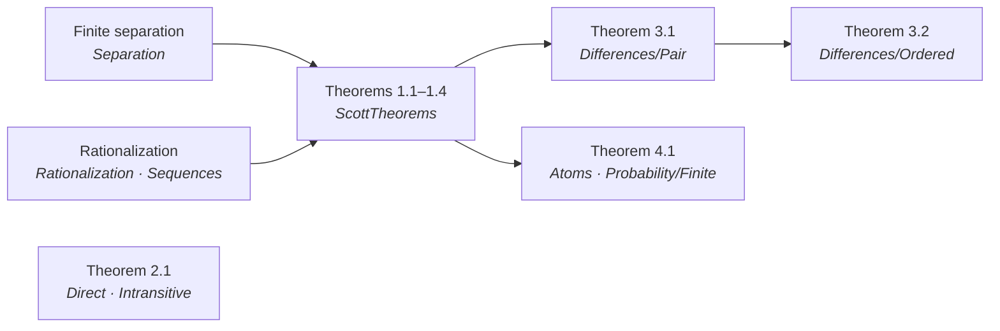
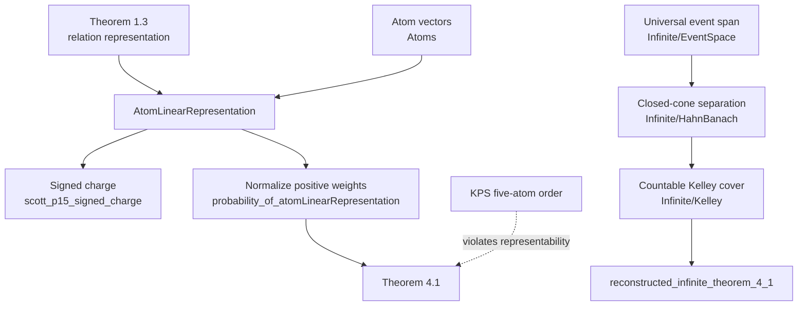

# A Lean 4 Formalization of Scott's Measurement Structures and Linear Inequalities (1964)

**Author.** Lars Warren Ericson (Catskills Research Company).
**Source paper.** Dana S. Scott, *Measurement Structures and Linear
Inequalities*, Journal of Mathematical Psychology 1 (1964), 233–247.
**Repository.** https://github.com/catskillsresearch/scott1964

---

## Abstract

This note records a Lean 4 / mathlib formalization of Dana Scott's 1964 paper
*Measurement Structures and Linear Inequalities*. Scott begins with a
finite-dimensional separation criterion for systems of homogeneous linear
inequalities and then reuses it for three representation problems:
intransitive indifference, ordered utility differences, and qualitative
probability. The Lean development proves all eight numbered theorems in the
paper: Theorems 1.1–1.4, 2.1, 3.1, 3.2, and 4.1.

The sorry-free library consists of approximately 4,200 lines in 21 modules
under `Scott1964/MeasurementStructures/`. It also formalizes Scott's
ordered-group and signed-charge remarks, the literal characteristic-vector
form of probability cancellation, a finite Kraft–Pratt–Seidenberg
counterexample, and a separately labelled modern reconstruction of an
infinite probability theorem. The latter uses an explicit
`GeneralizedKelleyCondition`; it is not attributed to Scott's unstated,
unpublished extension mentioned in the paper's closing paragraph.

The repository has no project-defined axioms and no Lake dependency beyond
mathlib. Completed proofs use the standard classical mathlib footprint
`[propext, Quot.sound, Classical.choice]`. Deliberate proof holes occur only
in the Mathlib-only `Challenge.lean`; `Solution.lean` re-exports the
kernel-checked development. The project is packaged for
[Palomar](https://palomar-registry.org/about) with a Challenge / Solution
pair and `formalization.yaml` metadata.

Dana Scott was not contacted and did not participate in, review, or endorse
this formalization. Lean code was written by AI agents under the direction
and review of the author, who takes sole responsibility for the mathematical
content.

Proofs in this note are summarized at the level of their main constructions.
Short representative Lean fragments are copied from the library; a generated
review copy with its configured source appendix is available through
(`scripts/generate_arxiv_with_code.sh` → `arxiv_with_code.md`).

<!-- AI_MODEL_TOOL_BULLETS -->
<!-- /AI_MODEL_TOOL_BULLETS -->

## 1. Introduction

Measurement theory asks when qualitative comparisons can be represented by
real numbers. A relation on alternatives might be represented by utility
differences, a relation on pairs might be represented by the sum of two
utilities, and a relation on events might be represented by a finitely
additive probability. The difficult direction is sufficiency: given only
qualitative axioms, why must a numerical representation exist?

Scott's paper gives a common answer. Encode each qualitative comparison as a
linear inequality between vectors, then apply a finite separation theorem.
For a finite symmetric set $X$ in a real vector space and a chosen
"nonnegative" part $N\subseteq X$, a realization is a linear functional
$\varphi$ satisfying

$$
x\in N \quad\Longleftrightarrow\quad 0\leq\varphi(x)
\qquad (x\in X).
$$

Sign completeness ensures that every $x\in X$ receives at least one weak
sign. Cancellation prevents a positive combination of strictly positive
vectors from collapsing into the neutral span. Together these conditions
separate the strict cone from the neutral subspace and produce
$\varphi$. Rational coordinates permit positive real coefficients to be
replaced by integer multiplicities, yielding Scott's unweighted sequence
conditions.

The three applications use different incidence vectors but the same engine.

1. **Intransitive indifference.** A strict relation $P$ on a finite set is
   represented by $xPy\iff f(x)\geq f(y)+1$.
2. **Ordered differences.** Comparisons of pairs are represented first by
   $f(x)+f'(x')$, then reversal combines the two scales into one utility
   difference $f(x)-f(y)$.
3. **Subjective probability.** An event in a finite Boolean algebra is sent
   to its $0/1$ incidence vector on atoms. A separating functional gives
   atom weights, which normalize to a probability.

The formalization follows this mathematical decomposition rather than
treating the eight theorems as unrelated endpoints. It also records where a
proof route differs from Scott's exposition: most importantly, Theorem 2.1
currently uses a direct finite Scott–Suppes staircase construction, while
Scott's local cycle reductions are formalized separately.

## 2. Scope and layout

The library has 21 Lean modules and approximately 4,200 lines. The root
module `Scott1964/MeasurementStructures/Basic.lean` re-exports the complete
development imported by `Solution.lean`.

| Module cluster | Role |
| --- | --- |
| `FinHead` | Stable distinguished index in `Fin (n + 1)` cancellation schemes |
| `LinearInequalities/Definitions`, `Separation`, `Sequences` | Geometric and sequence forms of Scott's finite inequality criterion |
| `LinearInequalities/Rationalization`, `ScottTheorems` | Rational coefficient clearing and Theorems 1.1–1.4 |
| `LinearInequalities/OrderedGroup` | Finite local real embedding and lexicographic obstruction |
| `Preference/Direct`, `Intransitive`, `Cycle` | Scott–Suppes construction, Theorem 2.1, and source proof reductions |
| `Differences/Pair`, `Ordered` | Incidence vectors and Theorems 3.1–3.2 |
| `Probability/Basic`, `Atoms`, `Finite` | Finitely additive probabilities, atom vectors, signed charges, and Theorem 4.1 |
| `Probability/KPSCounterexample` | Exact five-atom KPS qualitative order and nonrepresentability |
| `Probability/Infinite/*` | Universal event space, Hahn–Banach/Kelley machinery, and the modern infinite reconstruction |
| `Challenge` / `Solution` | Palomar statement of record and sorry-free realization |

The published scope is exactly the eight numbered theorems. Supplementary
results are clearly separated from that inventory:

- `finite_local_real_embedding` formalizes Scott's ordered-group observation;
- `scott_p15_signed_charge` and its vector form formalize the p. 15
  signed-measure characterization;
- `deFinetti_axioms_insufficient` integrates the KPS five-atom obstruction;
- `reconstructed_infinite_theorem_4_1` is a modern theorem motivated by, but
  not identified with, Scott's closing announcement.

The project is standalone. It imports none of the sibling formalizations of
Scott's later domain-theory papers.

## 3. How the proofs use mathlib

Mathlib supplies the finite-dimensional analytic and algebraic substrate.
The predicates and reductions specific to Scott's paper are defined in this
repository.

**Finite-dimensional separation.** The key imported result is
`geometric_hahn_banach_compact_closed` from mathlib's locally convex
separation library. The formalization specializes it to a finite convex hull
and a finite-dimensional subspace. It then proves that the separator
vanishes on the subspace and is strictly positive on the finite set:

```lean
theorem finite_strict_separation {A B : Set L} (hA : A.Finite) :
    Disjoint (convexHull ℝ A) (Submodule.span ℝ B : Set L) ↔
      ∃ φ : Module.Dual ℝ L,
        (∀ x ∈ A, 0 < φ x) ∧ ∀ x ∈ B, φ x = 0
```

**Finite combinatorics.** Cancellation schemes are indexed by
`Fin (n + 1)` so that a distinguished comparison always exists. `Equiv.Perm`
expresses Scott's two independent permutations in the pair and
difference problems. `Finset` sums, subtype cardinalities, and
`Equiv.ofFiberEquiv` turn equality of incidence-vector sums into actual
permutations.

**Linear algebra over function spaces.** Scott's vectors are represented as
functions into `ℝ`. Pair incidence vectors live in `Sum A A' → ℝ`; event
vectors live in `{a : B // IsAtom a} → ℝ`. Mathlib linear maps provide the
representing functionals, while `Pi.single` and finite sums implement the
coordinate encodings.

**Finite Boolean algebras.** Mathlib's `BooleanAlgebra`, `IsAtom`, and
finite-lattice API support decomposition of each event as the supremum of
its atoms. The formalization proves both the atom-count and vector-sum
versions of cancellation and constructs finitely additive functions by
integrating atom weights.

**Classical quotient orders.** The direct proof of Theorem 2.1 uses
`Antisymmetrization` of a finite total preorder. Substitutability classes
remove duplicate preference profiles, and a recursively constructed
staircase gives the numerical representation.

**Functional analysis for the supplementary infinite theorem.** The
universal event space is a normed span of evaluation functions on all
finitely additive probabilities. Continuous dual separation and a
countable Kelley cover produce one functional that is nonnegative on weak
comparisons and positive on strict comparisons.

What mathlib does not supply is Scott's measurement-theoretic interface:
the sign and cancellation conditions, relation-difference encoding,
Scott–Suppes weak order, pair permutation principle, atom-vector transport,
or generalized Kelley condition. Those constructions are developed here.

## 4. Proof dependency structure

The main published development follows one linear-inequality core and three
applications.



Theorem 2.1 is shown as an independent branch because its completed proof is
the direct Scott–Suppes construction. The source-facing cycle lemmas remain
available for a future proof routed through the section-1 machinery.

The finite probability and modern infinite developments have distinct
foundations:



## 5. Theorem inventory

| Paper result | Lean theorem | Content |
| --- | --- | --- |
| Theorem 1.1 | `LinearInequalities.scott_theorem_1_1` | Finite symmetric sign systems: realizability iff sign completeness and positive-weight cancellation |
| Theorem 1.2 | `LinearInequalities.scott_theorem_1_2` | Rational-coordinate version with unweighted repeated summands |
| Theorem 1.3 | `LinearInequalities.scott_theorem_1_3` | Complete relations on finite rational vectors: realizability iff paired equal-sums cancellation |
| Theorem 1.4 | `LinearInequalities.scott_theorem_1_4` | Realizability iff extension to a strictly monotonic relation on the additive closure |
| Theorem 2.1 | `theorem_2_1` | Intransitive-indifference representation with unit discrimination threshold |
| Theorem 3.1 | `theorem_3_1` | Additive representation of pair comparisons by two utilities |
| Theorem 3.2 | `theorem_3_2` | Ordered-difference representation by one utility |
| Theorem 4.1 | `theorem_4_1` | Finite qualitative probability representation |

Further source-facing or diagnostic results:

| Topic | Lean theorem | Status |
| --- | --- | --- |
| Literal form of `(4_B)` | `theorem_4_1_vector` | Equivalent vector-sum version of Theorem 4.1 |
| Scott's p. 15 signed charge | `scott_p15_signed_charge`, `_vector` | Proved without normalization or nonnegativity |
| Ordered-group remark | `finite_local_real_embedding` | Proved for each finite subset |
| Global obstruction | `no_global_real_additive_lex_realization` | Lexicographic `ℤ × ℤ` has no global additive real representation |
| KPS counterexample | `deFinetti_axioms_insufficient` | Exact five-atom order satisfies bundled de Finetti axioms but has no probability realization |
| Infinite analogue | `Probability.Infinite.reconstructed_infinite_theorem_4_1` | Modern result under `GeneralizedKelleyCondition`; not attributed to Scott |

The Palomar comparison locks all eight published theorems and the separately
labelled infinite reconstruction, together with the 28 definitions appearing
in their types. The Challenge imports only Mathlib; the Solution imports the
corresponding completed declarations.

## 6. Proof notes

### 6.1 Theorem 1.1 — finite separation

Let $X$ be finite and symmetric, and let $N\subseteq X$ denote the
vectors declared nonnegative. The strict vectors are those $x\in N$ for
which $-x\notin N$; the neutral vectors have both signs. Scott's
cancellation hypothesis states geometrically that the convex hull of the
strict set is disjoint from the linear span of the neutral set.

`weightedCancellation_of_sequence` derives this geometric disjointness from
the literal positive-weight sequence condition. It expands a hypothetical
intersection point twice: as a convex combination of strict vectors and as a
linear combination of neutral vectors. Signs of the latter coefficients are
absorbed using symmetry, producing one positive finite dependence. Sequence
cancellation would force the negative of a strict vector into $N$, a
contradiction.

`finite_strict_separation` then produces a linear functional positive on
strict vectors and zero on neutral vectors. Sign completeness proves that
the functional realizes $N$:

```lean
theorem scott_theorem_1_1 {X N : Set L}
    (hX : X.Finite) (hsym : Symmetric X) :
    Realizable X N ↔
      SignComplete X N ∧ WeightedSequenceCancellation X N
```

The necessary direction is elementary: apply a realizing functional to a
positive dependence and compare signs.

### 6.2 Theorem 1.2 — rationalization

Theorem 1.2 replaces arbitrary positive real coefficients with repeated
unit coefficients when vectors have rational coordinates. The nontrivial
direction of `UnweightedSequenceCancellation.rationalWeighted` is factored
through `Rationalization.lean`:

1. a positive real dependence among finitely many rational vectors is
   replaced by a positive rational dependence;
2. denominators are cleared to positive natural multiplicities;
3. each vector is repeated according to its multiplicity;
4. unweighted cancellation applies to the resulting finite sequence.

This is the precise point where `[Fintype S]` and `IsRationalSet X` enter.
Theorem 1.1 then supplies the realizing functional.

### 6.3 Theorems 1.3 and 1.4 — relations and additive closure

For a relation $R$ on a finite set $Y$, Theorem 1.3 moves from points to
differences $x-y$. Completeness gives sign completeness of the difference
set. Scott's paired equal-sums condition gives unweighted cancellation:

$$
\sum_i x_i=\sum_i y_i,\quad x_i R y_i\ (i\neq 0)
\quad\Longrightarrow\quad y_0 R x_0.
$$

The proof constructs the symmetric rational difference set and applies
Theorem 1.2. A short two-element cancellation argument ensures that the
functional's weak inequality implies the original relation rather than only
some relation with the same positive cone.

Theorem 1.4 characterizes the same realizability by extension to the additive
closure $Y^+$. A realizing functional immediately defines the extension.
Conversely, strict monotonicity gives paired cancellation by summing all
comparisons except the distinguished one and cancelling equal totals:

```lean
theorem scott_theorem_1_4 {S : Type*} [Fintype S]
    {Y : Set (S → ℝ)} {R : (S → ℝ) → (S → ℝ) → Prop}
    (hY : Y.Finite) (hYrat : IsRationalSet Y) :
    RelationRealizable Y R ↔
      ∃ Rplus,
        ExtendsOn Y (additiveClosure Y) R Rplus ∧
        StrictlyMonotonic (additiveClosure Y) Rplus
```

### 6.4 Theorem 2.1 — intransitive indifference

Scott's relation permits indifference to be intransitive while preserving a
real representation with a fixed discrimination threshold:

$$
xPy \quad\Longleftrightarrow\quad f(x)\geq f(y)+1.
$$

The forward implications to irreflexivity and the two quadruple axioms are
linear arithmetic. The completed converse uses a direct finite
Scott–Suppes construction. `ScottWeakOrder` compares alternatives by their
strict-preference profiles. The quadruple axioms make it a total preorder;
`Antisymmetrization` quotients alternatives with identical profiles. On the
finite quotient, lower sections are nested, and
`finite_staircase_representation` recursively assigns real values with the
required unit gap. The representation is then pulled back to alternatives.

```lean
theorem theorem_2_1 {A : Type u} [Fintype A] [Nonempty A]
    (P : A → A → Prop) :
    RealizablePreference P ↔
      PrefIrrefl P ∧ PrefQuadA P ∧ PrefQuadB P
```

The library also verifies Scott's remarks around the theorem: every positive
threshold is equivalent up to rescaling, every realization can be widened to
a positive margin, and on a finite set the boundary can be avoided with a
strict inequality. `Preference/Cycle.lean` separately proves transitivity
and the three local cycle-shortening moves used in Scott's printed route.
There is not yet a second completed proof assembling those reductions through
the section-1 linear-inequality theorem.

### 6.5 Theorems 3.1 and 3.2 — pairs and differences

For Theorem 3.1, a pair $(x,x')$ is represented by an incidence vector
having one unit coordinate in each side of `Sum A A'`. Equality of sums of
such vectors means that the first coordinates and second coordinates occur
with the same multiplicities. `pairVector_sum_eq_permutations` upgrades those
fiberwise cardinality equalities to two permutations.

The pair relation is transported to the finite rational range of
`pairVector`. Pair totality becomes relation completeness and Scott's
permutation axiom becomes paired sequence cancellation. Theorem 1.3 then
returns a functional $\varphi$. Restricting $\varphi$ to the two kinds of
singleton coordinates yields $f$ and $f'$:

```lean
theorem theorem_3_1 {A : Type u} {A' : Type v}
    [Fintype A] [Nonempty A] [Fintype A'] [Nonempty A']
    (V : A → A' → A → A' → Prop) :
    RealizableUtilityPair V ↔ PairTotal V ∧ PairPermutation V
```

Theorem 3.2 treats a difference comparison $D(x,y,z,w)$ first as a pair
comparison represented by $g(x)+q(y)$. Reversal supplies the second
inequality needed to combine the scales. The function $f(x)=g(x)-q(x)$
then represents the ordered differences. Thus the sufficiency proof is a
short application of Theorem 3.1 plus `difference_of_pair_and_reversal`.

Condition `(2_D)` remains an infinite scheme: Lean quantifies over every
`n : ℕ` and both permutations of `Fin (n + 1)`. No finite truncation is
claimed.

### 6.6 Theorem 4.1 — finite subjective probability

For a finite Boolean algebra $B$, `atomVector x` is the real-valued
characteristic function of the atoms below $x$. It is injective, and finite
additivity is coordinate addition on disjoint suprema.

Scott writes `(4_B)` as equality of algebraic sums of characteristic
functions. The primary `ProbCancellation` uses the equivalent atom-counting
reading stated immediately after the theorem: each atom occurs below equally
many events on the two sides. `ProbVectorCancellation` is the literal
vector-sum form, and the equivalence is proved explicitly:

```lean
theorem probVectorCancellation_iff_probCancellation :
    ProbVectorCancellation R ↔ ProbCancellation R
```

Totality and cancellation are transported through the range of `atomVector`
and discharged by Theorem 1.3, yielding `AtomLinearRepresentation R`.
Evaluation of the resulting functional on atom vectors is already a finitely
additive signed charge. Nontriviality makes its value at $\top$ positive;
nonnegativity makes all event values nonnegative. Division by the top value
normalizes the charge without changing comparisons:

```lean
theorem theorem_4_1 {B : Type u} [BooleanAlgebra B] [Fintype B]
    (R : B → B → Prop) :
    RealizableProbability R ↔
      ProbNontrivial R ∧ ProbNonneg R ∧
      ProbTotal R ∧ ProbCancellation R
```

The structure `IsProbability` includes zero at $\bot$, normalization at
$\top$, finite additivity on disjoint events, and nonnegativity.
`IsSignedCharge` deliberately omits normalization and nonnegativity. This
separation makes Scott's p. 15 statement exact:

```lean
theorem scott_p15_signed_charge (R : B → B → Prop) :
    RealizableSignedCharge R ↔ ProbTotal R ∧ ProbCancellation R
```

Cancellation also derives reflexivity, transitivity, and both directions of
de Finetti's disjoint-union invariance. These lemmas connect Scott's stronger
cancellation criterion with the older qualitative-probability axioms.

### 6.7 Ordered groups and the lexicographic boundary

Scott observes after Theorem 1.4 that finite pieces of an ordered abelian
group can be represented in the reals while preserving the addition equations
visible in that piece. `finite_local_real_embedding` encodes order tests and
local addition tests as rational coordinate vectors and applies Theorem 1.4.
It produces an order-reflecting $f:S\to\mathbb R$ preserving every equation
$x+y=z$ whose three terms lie in the finite set.

This local statement cannot be extended globally without an Archimedean
hypothesis. The lexicographic group $\mathbb Z\times\mathbb Z$ supplies the
counterexample. Its positive comparison is strictly monotonic on the
additive closure of two generators, but any additive real representation
would force one positive generator to dominate arbitrarily many multiples of
the other. `no_global_real_additive_lex_realization` formalizes the
contradiction.

### 6.8 The Kraft–Pratt–Seidenberg counterexample

`Probability/KPSCounterexample.lean` encodes the exact 32-event order on a
five-atom powerset from Kraft, Pratt, and Seidenberg. Finite decidability is
used to verify comparability, transitivity, bottom minimality, and de
Finetti's disjoint-union invariance. These are bundled as `DeFinettiAxioms`.

Nonrepresentability is not left to exhaustive computation. Finite additivity
expresses every event weight as a sum of singleton weights, and selected
strict comparisons in the KPS order force an impossible cycle of linear
inequalities. Consequently:

```lean
theorem deFinetti_axioms_insufficient :
    DeFinettiAxioms KPSGe ∧ ¬RealizableProbability KPSGe
```

`DeFinettiAxioms` uses de Finetti's literal weak nontriviality condition
`¬ R ⊥ ⊤`. Scott's `ProbNontrivial` is stronger:
`R ⊤ ⊥ ∧ ¬ R ⊥ ⊤`.

### 6.9 Modern reconstruction of an infinite analogue

Scott's final paragraph announces an extension to infinite Boolean algebras
but gives neither a theorem statement nor hypotheses. The repository
therefore does not attempt to recover or attribute that unpublished result.
Instead it proves a modern analogue under a fully explicit condition.

`EventSpace.lean` embeds each event into the normed span of its evaluation
function over all finitely additive probabilities. Stone-point indicators
prove that this encoding is faithful. Weak comparisons generate a closed
cone, described by its continuous-dual polar. Strict comparison vectors are
covered by countably many closed convex upper sets avoiding zero—the
`GeneralizedKelleyCondition`.

`Kelley.lean` separates each layer from zero and combines the separators with
summable positive coefficients. The resulting continuous functional is
nonnegative on every weak comparison and strictly positive on every strict
comparison. Its value at $\top$ is positive, so normalization yields a
finitely additive probability representing the relation:

```lean
theorem reconstructed_infinite_theorem_4_1 (R : B → B → Prop) :
    RealizableProbability R ↔
      ProbNontrivial R ∧ ProbNonneg R ∧ ProbTotal R ∧
        GeneralizedKelleyCondition R
```

This theorem is a supplementary reconstruction, not a ninth theorem of
Scott's published paper.

## 7. Source fidelity

The working source is `sources/ScottMeasurement1964.pdf`. A searchable
triple-pass vision transcription is generated at
`sources/ScottMeasurement1964_vision.md` by
`scripts/ocr_pdf_pipeline.sh`. The PDF and transcription are source material,
not part of the Apache-2.0 grant.

### 7.1 Formal conventions

Scott writes finite sequences with an exceptional zeroth term. Lean uses
`Fin (n + 1)` and the named index `finHead n`; this avoids empty-index edge
cases and stabilizes the statements used by the Palomar Comparator.

Relations are oriented as "at least as preferred/probable." Thus
`RelationRealizable Y R` states
`R x y ↔ φ y ≤ φ x`, and `RealizableProbability R` states
`R x y ↔ μ x ≥ μ y`. Scott's strict comparison is represented by
`StrictlyPreferred R x y := ¬ R y x`.

The finite probability theorem uses abstract finite Boolean algebras rather
than a concrete powerset. Characteristic vectors are indexed by Boolean
atoms, which is equivalent to choosing the atoms of a finite field of events.

The development is classical. The disclosed axiom footprint is
`propext`, `Quot.sound`, and `Classical.choice`; no project axiom is declared.

### 7.2 Recorded divergences and limitations

- Theorem 2.1 is completed by the direct finite Scott–Suppes staircase
  construction. Scott's local cycle reductions are formalized in
  `Preference/Cycle.lean`, but they are not assembled into an alternate
  section-1 proof.
- The primary `theorem_4_1` uses Scott's atom-count explanation of `(4_B)`.
  `theorem_4_1_vector` separately proves the equivalent literal equality of
  characteristic-vector sums.
- Scott's closing paragraph does not state his infinite theorem.
  `reconstructed_infinite_theorem_4_1` is explicitly a modern
  Hahn–Banach/Kelley reconstruction under `GeneralizedKelleyCondition`.
- The KPS development formalizes an external 1958 counterexample used to
  delimit the strength of de Finetti's axioms; it is not a numbered theorem
  of Scott's article.
- No external mathematical review has been performed. Every proof is checked
  by the Lean kernel, but the project remains self-assessed.

## 8. Palomar statement of record

`Challenge.lean` contains Mathlib-only declarations with deliberate theorem
holes. `Solution.lean` imports the completed library. `comparator.json`
compares the nine theorem names (eight published theorems plus the separately
labelled infinite reconstruction) and 28 definitions in their statement
closure.

| File | Role |
| --- | --- |
| `Challenge.lean` | Mathlib-only statement of record with deliberate `sorry` |
| `Solution.lean` | Re-exports matching kernel-checked declarations |
| `comparator.json` | Compared theorem/definition names and permitted axioms |
| `formalization.yaml` | Scope, source alignment, fidelity, and review metadata |
| `PROVENANCE.md` | Standalone status and relation to sibling Scott projects |
| `docs/PALOMAR_EDITORIAL_AUDIT.md` | Mechanical and editorial preflight discipline |

The compared inventory is narrower than the entire library only in the sense
that supplementary lemmas are reached through the published capstones rather
than all being named independently. `Solution.lean` and every file below
`Scott1964/` must remain sorry-free.

## 9. Build and preflight

The repository pins Lean and mathlib **v4.33.0**.

```bash
lake exe cache get
lake build
bash scripts/palomar_preflight.sh --mechanical-only   # CI / routine
bash scripts/palomar_preflight.sh                     # before Palomar submission
bash scripts/generate_arxiv_with_code.sh              # → arxiv_with_code.md
```

`lake build` checks the `Scott1964`, `Challenge`, and `Solution` targets.
Mechanical preflight validates packaging, builds the project, compares
Challenge/Solution declaration types and closure values, runs Palomar's
pinned Comparator, scans completed sources for proof holes, checks permitted
axioms, and checks patch formatting. Full preflight adds policy synchronization
and the editorial audit.

`arxiv_with_code.md` is a generated review artifact: this narrative followed
by the source appendix configured in `scripts/generate_arxiv_with_code.py`.
It is gitignored and should be regenerated whenever `arxiv.md` or a listed
source file changes.

## 10. License and source PDF

Original Lean code and author-written documentation are Apache-2.0.
`sources/ScottMeasurement1964.pdf` and its transcription are not
Apache-2.0; see `NOTICE` and `sources/README.md` for the copyright carve-out.

<!-- AI_MODEL_REFERENCES -->
<!-- /AI_MODEL_REFERENCES -->
